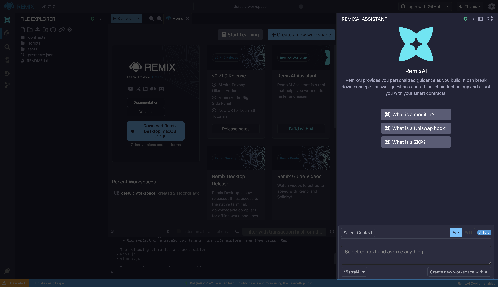
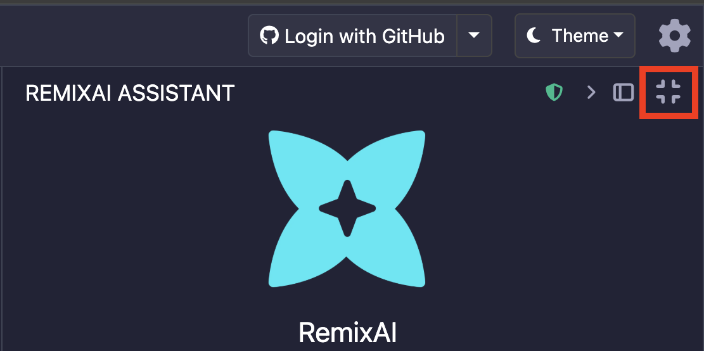
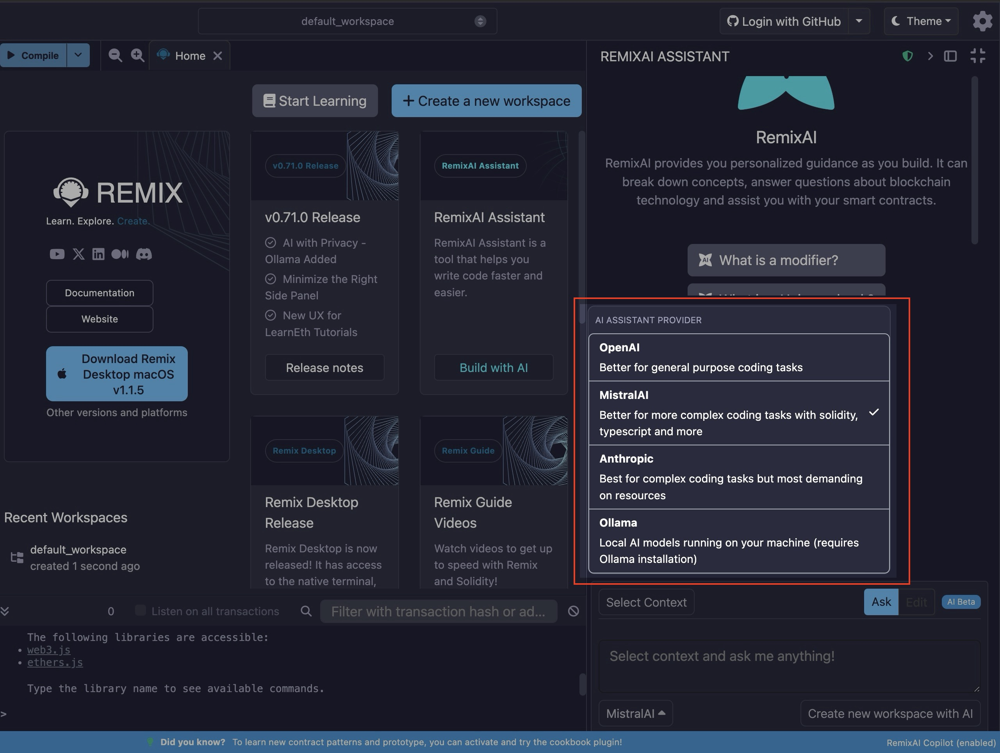
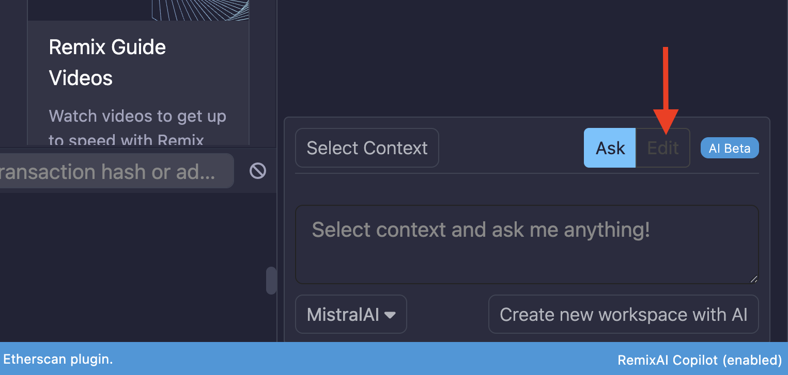

# AI Tools

Remix has its own AI tool named **RemixAI** and a sub-project called **RemixAI Copilot** for code completion.

When you load Remix, the **RemixAI Assistant** appears in the Right Side Panel.



```{tip}
You can minimize the RemixAI Assistant by clicking the minimize icon at the top left of the Right Side Panel.
```



RemixAI is also integrated into other parts of the tool including:

- [**Explain contract**](#choosing-an-llm-for-code-explanations) button at the bottom of the Editor when a .sol file is active.
- [**Explain compiler error**](#compilers-explain-error) button when an error is thrown in the Solidity Compiler.
- [**Right-click menu options**](#editor-right-click-menu) in the Editor.
- [**Code requests in the Editor**](#editor-ask-remixai-with) by prepending an AI code request in a file with a double slash (//).

## Choosing an LLM for code explanations

In the RemixAI Assistant, there is a choice of LLMs for use in **code explanations** and in the AI Assistant. The default LLM is MistralAI. But click the MistralAI button and a modal will popup where you can select Anthropic, OpenAI, or MistralAI.



The RemixAI Assistant will responds to questions in the language in which it's asked and is able to answer questions about Solidity, JS/TS, Vyper and other computer languages.

```{note}
You can click the "Explain Contract" button at the bottom of the Editor when a .sol file is active.

```

## Using a Local LLM for Privacy

When using an LLM, unless the LLM is local, the model is training itself on whatever you’re inputting. This “training” means the AI model is saving your information for its own use. So when you want to use an AI tool while keeping your information private, you can now use a local LLM.

Remix supports Ollama, a local AI model runner that allows you to download large language models to run on your own machine.

The Ollama LLMs supported by Remix include: `codestral:latest`,`quen3-coder:latest`, `gpt-oss:latest`, and `deepseek-coder-v2:latest` (great for code completion).

In addition to privacy with Remix’s Ollama integration, you get:

- No API Rate Throttling: No usage fees or rate limits
- Offline Capability: Works without internet connection
- Fill-in-Middle (FIM) Support: Advanced code completion capabilities

```{note}
The Ollama integration does not allow agentic workflows like online RemixAI currently does. Additionally, Ollama cannot edit Workspaces directly.
```

To use Ollama, click the select LLM dropdown, select "**Ollama**", then follow the instruction in the RemixAI Assistant.

## Adding context to the LLM

Clicking the `@Add context` button will bring up a modal where you can set the context of your request.


You can also set the context to the current Workspace while you type, by starting a request with `/w`.

## Code Completion

When you type a space or a new line, the RemixAI Assistant will propose some code. The proposed code is a technique called, **code completion**. The RemixAI Assistant's suggested code will take into account what has already been written in the file.

The switch to activate it is at the bottom left of the Main Panel when a file is active. Once activated, suggests code using MistralAI LLM. For **code completion** there is no choice of LLM.


```{note}
All other RemixAI tools are always on.
```

## Editor: Right-click Menu

When you right-click a function, a popup menu appears with some options executed by the RemixAI. They include, **Explain this function**, **Explain this code**, and **Generate documentation**.


The "Explain this code" option in the Editor's Right-click menu can be triggered with, or without, highlighting a block of code. If some code has not been highlighted, RemixAI will take into account the code surrounding the cursor.

## Editor: Code Completion

As explained above, with the RemixAI Copilot switched on, when you put a space after a word or make a new line, the Copilot will make a suggestion.


Hit tab to accept the suggestion.


## Editor: Ask RemixAI with //

In the Editor, when the AI Copilot is on, you can ask it a coding question with the `//` prompt.
For example:

```text
// write a function that returns an array with 3 elements from the function's parameters
```

## Editor: Edit Files with Remix AI

You can also edit files directly with the RemixAI Assistant and even generate new contracts. To edit a file, with the AI, switch from "Ask" to "Edit" on the RemixAI Right Side Panel.



...and feed the AI instruction on what you need to edit or generate.

```{tip}
You can provide the file you want to edit or generate a new contract on [as context](#adding-context-to-llm) to get the best results.

```

## Compilers: Explain Error

In the compiler error "cards" of both the Solidity Compiler and the Vyper compiler there is a button to "Ask RemixAI".


