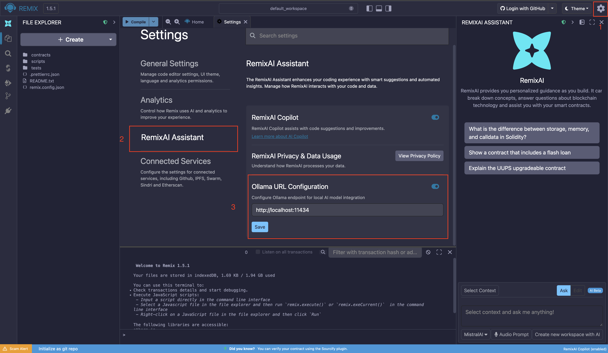
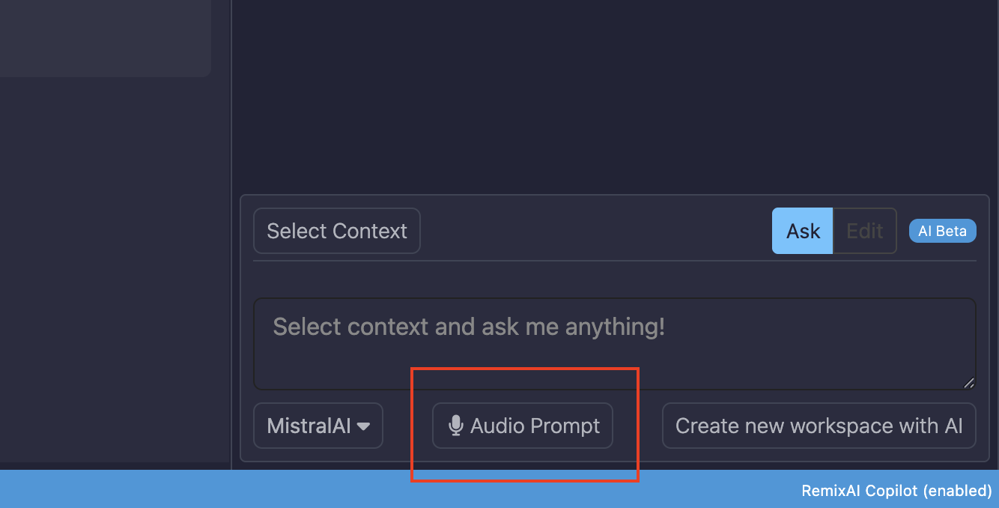

AI Tools
========

Remix has its own AI tool named **RemixAI** and a sub-project called
**RemixAI Copilot** for code completion.

When you load Remix, the **RemixAI Assistant** appears in the Right Side Panel.

.. image:: images/ai/remixai-right-panel.png
   :alt: RemixAI Assistant Right Side Panel

.. tip::
   You can minimize the RemixAI Assistant by clicking the minimize icon at the
   top left of the Right Side Panel.

.. image:: images/ai/minimize-sidebar.png
   :alt: Minimize AI side bar

RemixAI is also integrated into other parts of the tool including:

- The **Explain contract** button at the bottom of the Editor when a ``.sol`` file is active.
- The **Explain compiler error** button when an error is thrown in the Solidity Compiler.
- **Right-click menu options** in the Editor.
- **Code requests in the Editor** by prepending an AI code request in a file with a double slash (``//``).

Choosing an LLM for code explanations
-------------------------------------

In the RemixAI Assistant, there is a choice of LLMs for use in **code explanations**
and in the AI Assistant.

The default LLM is **MistralAI**. Click the MistralAI button and a modal will pop up
where you can select **Anthropic**, **OpenAI**, or **MistralAI**.

.. image:: images/ai/llm-dropdown.png
   :alt: RemixAI LLM dropdown menu

The RemixAI Assistant responds in the language in which it is asked and can answer
questions about Solidity, JavaScript/TypeScript, Vyper, and other programming languages.

.. note::

   You can click the **Explain Contract** button at the bottom of the Editor when a
   ``.sol`` file is active.

Using a local LLM for privacy
-----------------------------

When using an LLM, unless the model is running locally, your inputs may be used
by the provider for training or retention. This means the information you submit
could be stored or reused.

If you want to use AI tools while keeping your information private, you can use
a **local LLM**.

Remix supports **Ollama**, a local AI model runner that allows you to download and
run large language models (LLMs) directly on your own machine.

The Ollama LLMs supported by Remix include:

- ``codestral:latest``
- ``quen3-coder:latest``
- ``gpt-oss:latest``
- ``deepseek-coder-v2:latest`` (recommended for code completion)

In addition to privacy, Remix’s Ollama integration provides:

- **No API rate throttling** – no usage fees or rate limits
- **Offline capability** – works without an internet connection
- **Fill-in-the-Middle (FIM) support** – advanced code completion features

.. note::
   The Ollama integration does not support agentic workflows available in the
   online RemixAI service, such as Remix MCP or generating and editing
   Workspaces. Its capabilities are limited to code completion and
   conversational interactions.

Setting up Ollama in Remix
^^^^^^^^^^^^^^^^^^^^^^^^^^
Before using Ollama with Remix, ensure the following requirements are met:

- **Ollama is installed** on your system. Visit the
  `Ollama website <https://ollama.com/>`_ to download and install it.
- **An Ollama account** is set up.
- **At least one supported or recommended model** is installed locally.

After completing the setup, start the Ollama server by running:

.. code-block:: shell

   ollama serve

By default, the Ollama service listens on:

::

   http://localhost:11434

You can confirm that Ollama is running by visiting the URL above. If it is running, you should see the message below.

.. image:: /images/ai/ollama-running.png
   :alt: Ollama is running text in browser.

Next, to allow the Remix IDE to communicate with your local Ollama instance, you must
configure **CORS**. See `how to setup CORS for Ollama <https://objectgraph.com/blog/ollama-cors/>`_ for instructions specific to your operating system.
Once configured, restart the Ollama service and your terminal instance to apply the changes.

You can check if Remix is on your Ollama allowlist by running the command below:

.. code-block:: shell

   curl -X OPTIONS http://localhost:11434 \
  -H "Origin: https://remix.ethereum.org" \
  -H "Access-Control-Request-Method: GET" \
  -I

If "remix.ethereum.org" is configured properly, you will get the message below:

.. code-block:: shell

   HTTP/1.1 204 No Content
   Access-Control-Allow-Headers: Authorization, Content-Type, User-Agent, Accept, X-Requested-With, Openai-Beta, X-Stainless-Arch, X-Stainless-Async, X-Stainless-Custom-Poll-Interval, X-Stainless-Helper-Method, X-Stainless-Lang, X-Stainless-Os, X-Stainless-Package-Version, X-Stainless-Poll-Helper, X-Stainless-Retry-Count, X-Stainless-Runtime, X-Stainless-Runtime-Version, X-Stainless-Timeout
   Access-Control-Allow-Methods: GET, POST, PUT, PATCH, DELETE, HEAD, OPTIONS
   Access-Control-Allow-Origin: https://remix.ethereum.org
   Access-Control-Max-Age: 43200
   Allow: HEAD, GET
   Vary: Origin
   Vary: Access-Control-Request-Method
   Vary: Access-Control-Request-Headers
   Date: Sun, 11 Jan 2026 23:52:32 GMT

.. tip:: 
   If you run into any issues check out our `Ollama troubleshooting guide <https://github.com/remix-project-org/remix-project/blob/master/OLLAMA_SETUP.md#troubleshooting/>`_.

After the setup, select Ollama as the model on RemixAI and it will automatically detect the supported models you have on your device. You can select your preferred model and use it for code completion and assistance.

.. image:: /images/ai/ollama-remix.png
   :alt: RemixAI assistant with Ollama as the model

Running Ollama in the cloud with Remix
--------------------------------------

Large language models (LLMs) are resource-intensive and may not run efficiently on
all local machines. If system resources or disk space are a concern, you can run a
private LLM on another machine or in the cloud and configure Ollama to connect to it
remotely.

Remix supports this by allowing you to specify the Ollama server URL.

Follow the steps below to configure a remote Ollama instance in Remix:

1. Click the **gear icon** in the top-right corner of Remix to open the **Settings** panel.
2. Navigate to the **RemixAI Assistant** section.
3. Under **Ollama URL Configuration**, enter the URL of the machine running Ollama.

.. TODO: Uncomment after PR that implements video is merged
.. .. video:: ./images/ai/cloud-ollama.mp4
..   :nocontrols:
..   :autoplay:
..   :playsinline:
..   :muted:
..   :loop:
..   :width: 100%

Adding context to the LLM
-------------------------

Clicking the ``@Add context`` button opens a modal where you can define the context
for your request.

.. image:: images/ai/remixai-add-context.png
   :alt: RemixAI add context flow

You can also set the context to the current Workspace while typing by starting
a request with ``/w``.

RemixAI accepts audio input
---------------------------

RemixAI allows you to interact with the AI Assistant using **audio input**, making it easier to ask questions or give instructions without typing.

To use audio input:

1. Open the **RemixAI Assistant** in the Right Side Panel.
2. Click the **microphone icon** in the Assistant input area.
3. Speak your question or instruction clearly.
4. RemixAI will transcribe your speech and respond as if the input were typed.

Audio input is especially useful for:
- Quickly asking questions while reviewing code
- Explaining issues in natural language
- Hands-free interaction during development

.. note::

   Audio input requires microphone access enabled in your browser. The availability of audio input may depend on
   browser support and permissions.

Code completion
---------------

When you type a space or start a new line, the RemixAI Assistant may propose code
suggestions. This feature is known as **code completion**.

The suggestions take into account what has already been written in the file.

The toggle to enable code completion is located at the bottom-left of the Main Panel
when a file is active. Once enabled, code completion uses the **MistralAI** LLM.
There is no LLM selection for code completion.

.. image:: images/ai/a-ai-switch.png
   :alt: Remix AI Copilot button

.. note::

   All other RemixAI tools are always enabled.

Editor: Right-click Menu
------------------------

When you right-click a function in the Editor, a popup menu appears with options
powered by RemixAI, including:

- **Explain this function**
- **Explain this code**
- **Generate documentation**

.. image:: images/ai/a-ai-editor-popup-menu.png
   :alt: Remix AI right click menu

The **Explain this code** option can be triggered with or without selecting code.
If no code is selected, RemixAI considers the code surrounding the cursor.

Editor: Code Completion
-----------------------

With the RemixAI Copilot enabled, typing a space or creating a new line triggers
a completion proposal.

.. image:: images/ai/a-ai-completion-proposal.png
   :alt: RemixAI completion proposal

Press ``Tab`` to accept the suggestion.

.. image:: images/ai/a-ai-completion-accepted.png
   :alt: RemixAI accepted completion

Editor: Ask RemixAI with //
---------------------------

When the AI Copilot is enabled, you can ask coding questions directly in the Editor
by starting a comment with ``//``.

Example:

::

   // write a function that returns an array with 3 elements from the function's parameters

Editor: Edit Files with RemixAI
-------------------------------

You can edit files directly using the RemixAI Assistant or generate new contracts.
To do this, switch the Assistant from **Ask** to **Edit** in the Right Side Panel.

.. image:: images/ai/edit-function.png
   :alt: Switch to Edit button

Then provide instructions describing what you want to edit or generate.

.. tip::

   Provide the file you want to edit or generate as context (see
   :ref:`Adding Context to the LLM`) to get the best results.

Compilers: Explain Error
------------------------

In the error cards of both the Solidity Compiler and the Vyper Compiler, there is
an **Ask RemixAI** button that helps explain compiler errors.

.. image:: images/ai/a-ai-solcomp1.png
   :alt: Compiler Explain Error
