AI Tools
========

.. meta::
   :description: RemixAI is Remix IDE's built-in AI assistant and Copilot for Solidity smart contract development, code completion, and explanation.
   :keywords: remixai, ai assistant, code completion, solidity ai, remix ide ai

Remix has its own AI tool named **RemixAI** and a sub-project called
**RemixAI Copilot** for code completion.

When you load Remix, the **RemixAI Assistant** appears in the Right Side Panel.

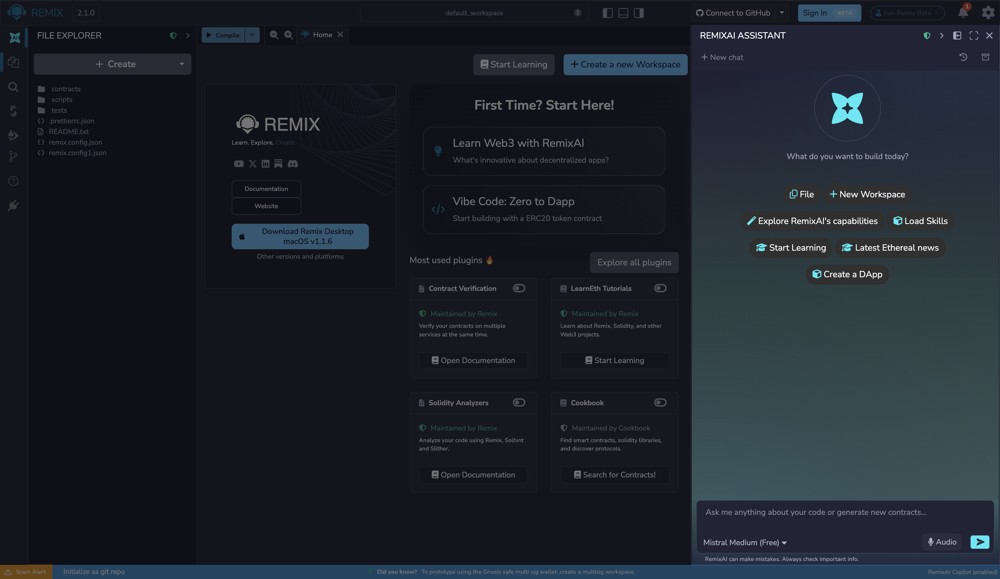

.. tip::
   You can minimize the RemixAI Assistant by clicking the minimize icon at the
   top left of the Right Side Panel.

.. video:: images/ai/maximize-ai.mp4
  :autoplay:
  :playsinline:
  :muted:
  :loop:
  :width: 100%

RemixAI is also integrated into other parts of the tool including:

- The **Explain contract** button at the bottom of the Editor when a ``.sol`` file is active.
- The **Explain compiler error** button when an error is thrown in the Solidity Compiler.
- **Right-click menu options** in the Editor.
- **Code requests in the Editor** by prepending an AI code request in a file with a double slash (``//``).

The RemixAI Assistant retains your conversation history within a session, so you can refer back to earlier responses or continue a previous request.

Choosing an LLM for code explanations
-------------------------------------

In the RemixAI Assistant, there is a choice of LLMs for use in **code explanations**
and in the AI Assistant.

The default LLM is **MistralAI**. Click the MistralAI button and a modal will pop up
where you can select **Anthropic**, **OpenAI**, or **MistralAI**.

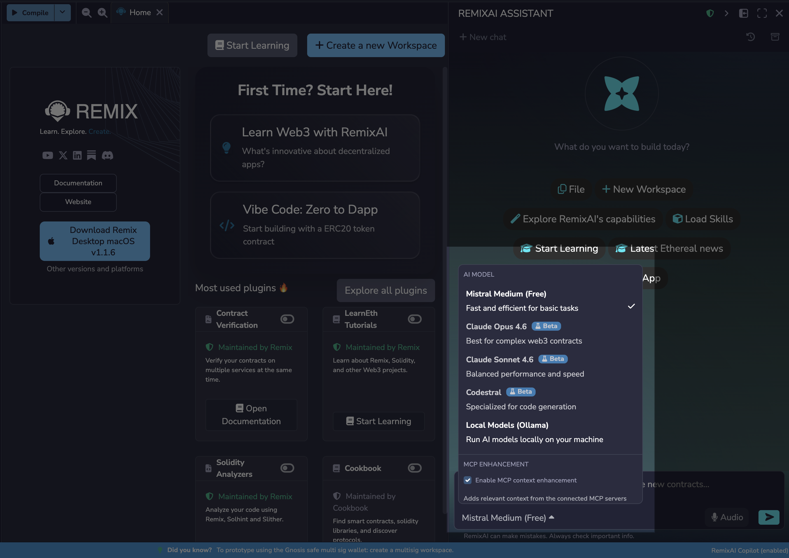

The RemixAI Assistant responds in the language in which it is asked and can answer
questions about Solidity, JavaScript/TypeScript, Vyper, and other programming languages.

Using a local LLM for privacy
-----------------------------

When using an LLM, unless the model is running locally, your inputs may be used
by the provider for training or retention. This means the information you submit
could be stored or reused.

If you want to use AI tools while keeping your information private, you can use
a **local LLM**.

Remix supports **Ollama**, a local AI model runner that allows you to download and
run large language models (LLMs) directly on your own machine.

The Ollama LLMs supported by Remix include:

- ``codestral:latest``
- ``qwen3-coder:latest``
- ``gpt-oss:latest``
- ``deepseek-coder-v2:latest`` (recommended for code completion)

In addition to privacy, Remix’s Ollama integration provides:

- **No API rate throttling** – no usage fees or rate limits
- **Offline capability** – works without an internet connection
- **Fill-in-the-Middle (FIM) support** – advanced code completion features

.. note::
   The Ollama integration does not support agentic workflows available in the
   online RemixAI service, such as Remix MCP or generating and editing
   Workspaces. Its capabilities are limited to code completion and
   conversational interactions.

Setting up Ollama in Remix
^^^^^^^^^^^^^^^^^^^^^^^^^^
Before using Ollama with Remix, ensure the following requirements are met:

- **Ollama is installed** on your system. Visit the
  `Ollama website <https://ollama.com/>`_ to download and install it.
- **At least one supported or recommended model** is installed locally.

After completing the setup, start the Ollama server by running:

.. code-block:: shell

   ollama serve

By default, the Ollama service listens on:

::

   http://localhost:11434

You can confirm that Ollama is running by visiting the URL above. If it is running, you should see the message below.

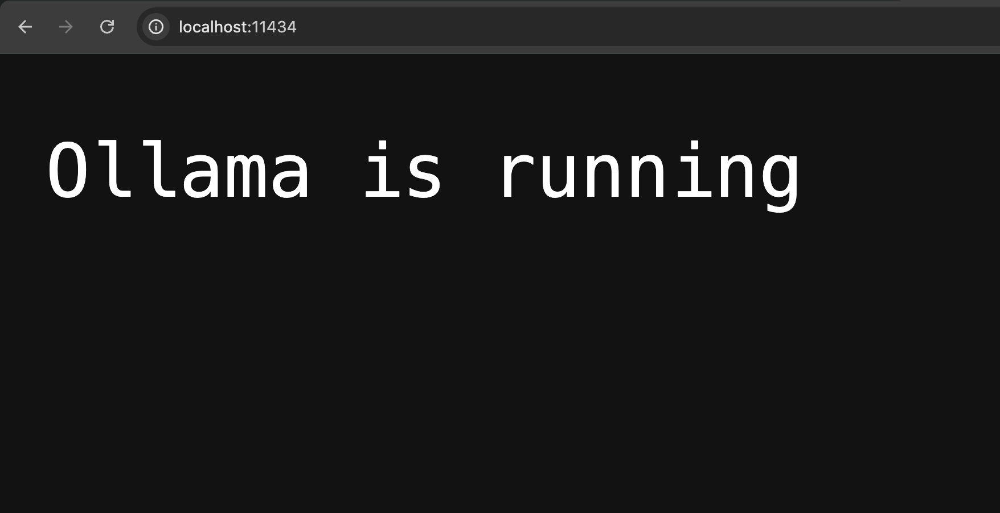

Next, to allow the Remix IDE to communicate with your local Ollama instance, you must
configure **CORS**. See `how to setup CORS for Ollama <https://objectgraph.com/blog/ollama-cors/>`_ for instructions specific to your operating system.

.. important::
   Once configured, restart the Ollama service and your terminal instance to apply the changes.

You can check if Remix is on your Ollama allowlist by running the command below:

.. code-block:: shell

   curl -X OPTIONS http://localhost:11434 \
  -H "Origin: https://remix.ethereum.org" \
  -H "Access-Control-Request-Method: GET" \
  -I

If "remix.ethereum.org" is configured properly, you will get the message below:

.. code-block:: shell

   HTTP/1.1 204 No Content
   Access-Control-Allow-Headers: Authorization, Content-Type, User-Agent, Accept, X-Requested-With, Openai-Beta, X-Stainless-Arch, X-Stainless-Async, X-Stainless-Custom-Poll-Interval, X-Stainless-Helper-Method, X-Stainless-Lang, X-Stainless-Os, X-Stainless-Package-Version, X-Stainless-Poll-Helper, X-Stainless-Retry-Count, X-Stainless-Runtime, X-Stainless-Runtime-Version, X-Stainless-Timeout
   Access-Control-Allow-Methods: GET, POST, PUT, PATCH, DELETE, HEAD, OPTIONS
   Access-Control-Allow-Origin: https://remix.ethereum.org
   Access-Control-Max-Age: 43200
   Allow: HEAD, GET
   Vary: Origin
   Vary: Access-Control-Request-Method
   Vary: Access-Control-Request-Headers
   Date: Sun, 11 Jan 2026 23:52:32 GMT

.. tip::
   If you run into any issues check out our `Ollama troubleshooting guide <https://github.com/remix-project-org/remix-project/blob/master/OLLAMA_SETUP.md#troubleshooting/>`_.

After the setup, select Ollama as the model on RemixAI and it will automatically detect the supported models you have on your device. You can select your preferred model and use it for code completion and assistance.

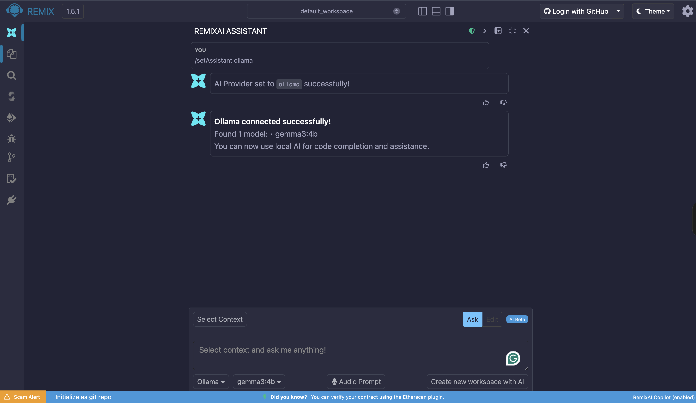

Running Ollama in the cloud with Remix
--------------------------------------

Large language models (LLMs) are resource-intensive and may not run efficiently on
all local machines. If system resources or disk space are a concern, you can run a
private LLM on another machine or in the cloud and configure Ollama to connect to it
remotely.

Remix supports this by allowing you to specify the Ollama server URL.

Follow the steps below to configure a remote Ollama instance in Remix:

1. Click the **gear icon** in the top-right corner of Remix to open the **Settings** panel.
2. Navigate to the **RemixAI Assistant** section.
3. Under **Ollama URL Configuration**, enter the URL of the machine running Ollama.

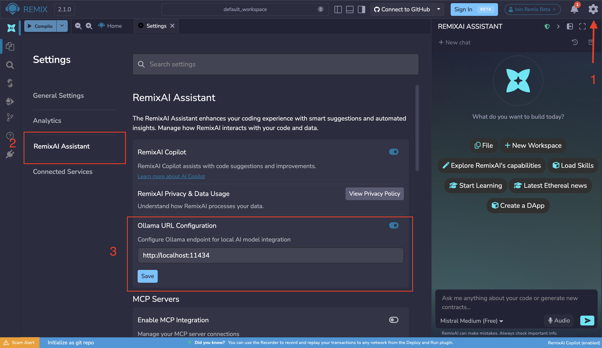

.. TODO: Uncomment after PR that implements video is merged
.. .. video:: ./images/ai/cloud-ollama.mp4
..   :nocontrols:
..   :autoplay:
..   :playsinline:
..   :muted:
..   :loop:
..   :width: 100%

RemixAI accepts audio input
---------------------------

RemixAI allows you to interact with the AI Assistant using **audio input**, making it easier to ask questions or give instructions without typing.

To use audio input:

1. Open the **RemixAI Assistant** in the Right Side Panel.
2. Click the **microphone icon** in the Assistant input area.
3. Speak your question or instruction clearly.
4. RemixAI will transcribe your speech and respond as if the input were typed.

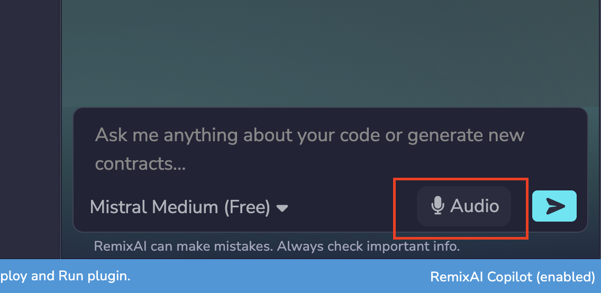

Audio input is especially useful for:

- Quickly asking questions while reviewing code
- Explaining issues in natural language
- Hands-free interaction during development

.. note::

   Audio input requires microphone access enabled in your browser. The availability of audio input may depend on
   browser support and permissions.

Model Context Protocol (MCP)
-----------------------------

Remix supports **Model Context Protocol (MCP)** servers, which give the RemixAI access to external tools and libraries during agentic workflows.

You can manage the MCP servers available to you in **Settings > RemixAI Assistant**. Here you can turn the available servers on and off, depending on your preferences.

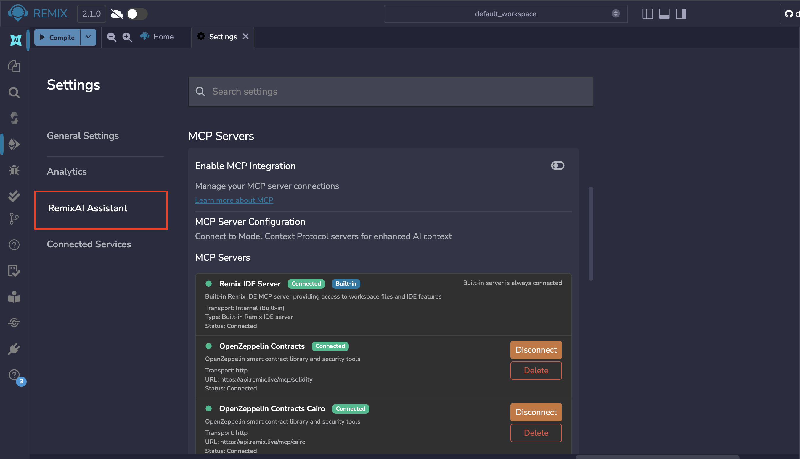

The following MCP servers are available in RemixAI:

- **Remix IDE Server** (Built-in) – Always connected. Gives the AI direct access to
  your workspace files and IDE features such as compilation, file management, and
  Slither static analysis.
- **OpenZeppelin Contracts** – Gives the AI access to OpenZeppelin's audited contract 
  library, so it can suggest secure, battle-tested implementations rather than 
  generating patterns from scratch.
- **Web Search** – Allows the AI to retrieve up-to-date information such as recent 
  protocol changes, audit reports, and external documentation.

The following MCP servers are additionally available to **Beta testers**:

- **ethSkills** – A curated Ethereum knowledge base designed specifically for AI 
  agents. It covers production-ready guidance across gas costs, L2s, token standards, 
  DeFi protocols, security patterns, contract auditing, and more, helping the AI avoid 
  stale or hallucinated answers about Ethereum development.
- **Alchemy** – Allows the AI to query live on-chain data including account balances, 
  transaction histories, and contract state via Alchemy's infrastructure.
- **Etherscan** – Allows the AI to look up deployed contracts, inspect verified source 
  code, and retrieve transaction data directly from the block explorer.
- **The Graph API** – Allows the AI to query indexed blockchain data via GraphQL 
  subgraphs, useful for retrieving protocol analytics and historical event data.

Sample prompts
^^^^^^^^^^^^^^

The examples below show how to phrase requests to get the most out of the RemixAI Assistant. Each section explains the intent behind the prompt type and gives one example.

**Writing contracts**

Ask RemixAI to generate a contract from a plain-language description. Be specific about the behaviour you want (access control, token standards, limits) and the AI will produce a starting implementation you can refine.

  *Write an ERC-20 token contract with a mint function restricted to the owner and a maximum supply of 1 million tokens.*

**Security review**

Ask RemixAI to analyse a specific contract or the active file for vulnerabilities. You can target a particular class of issue or ask for a general review. Slither static analysis is built into the Remix IDE Server, so the AI can run it and incorporate the results without any additional setup.

  *Review the active contract for reentrancy vulnerabilities and suggest fixes.*

**Using OpenZeppelin** *(OpenZeppelin MCP)*

Ask RemixAI to suggest or apply an OpenZeppelin implementation instead of writing custom logic. The AI has access to the full OpenZeppelin library and can recommend the right base contract for your use case.

  *Replace the access control in this contract with OpenZeppelin's Ownable.*

**Querying live on-chain data** *(Alchemy / Etherscan, Beta)*

Ask RemixAI to look up real-time blockchain data such as balances, transactions, or verified source code. Useful for investigating a deployed contract or checking an address without leaving the IDE.

  *Fetch the verified source code and recent transactions for this contract address: 0x...*

**Querying indexed protocol data** *(The Graph, Beta)*

Ask RemixAI to query a subgraph for aggregated or historical data. Useful for retrieving protocol-level metrics or event histories that are not available from a single contract call.

  *Get the total value locked in Aave on Ethereum over the last 7 days using a subgraph query.*

**General Solidity and Ethereum questions**

Ask RemixAI about language features, best practices, or protocol mechanics. The Web Search MCP server allows it to retrieve up-to-date information, so it can answer questions about recent changes that postdate its training data.

  *What changed in Solidity 0.8.24 that could affect a contract I wrote for 0.8.20?*

Code completion
---------------

When you type a space or start a new line, the RemixAI Assistant may propose code
suggestions. This feature is known as **code completion**.

The suggestions take into account what has already been written in the file.

The toggle to enable code completion is located at the bottom-left of the Main Panel
when a file is active. Once enabled, code completion uses the **MistralAI** LLM by default. If Ollama is configured as the active model, code completion will use the selected Ollama model instead.

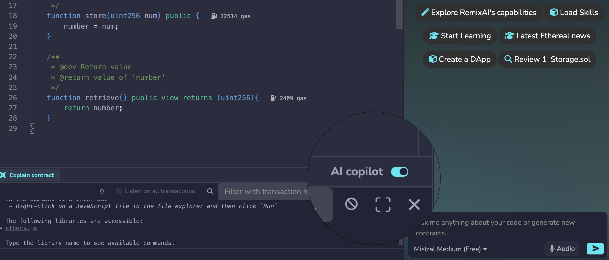

.. note::

   All other RemixAI tools are always enabled.

Editor: Right-click Menu
------------------------

When you right-click a function in the Editor, a popup menu appears with options
powered by RemixAI, including:

- **Explain this function**
- **Explain this code**
- **Generate documentation**

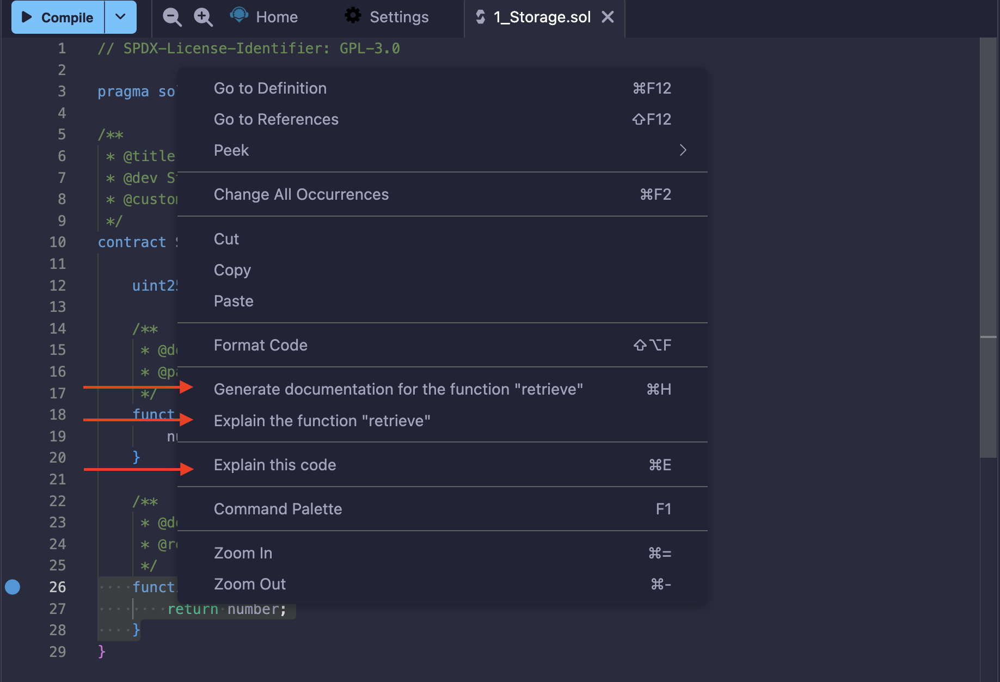

The **Explain this code** option can be triggered with or without selecting code.
If no code is selected, RemixAI considers the code surrounding the cursor.

Editor: Code Completion
-----------------------

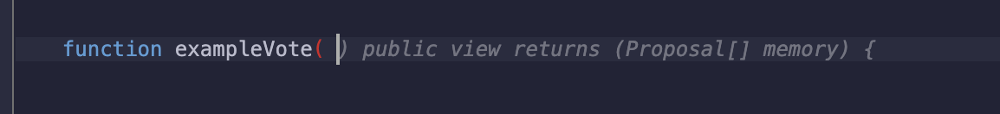

Press ``Tab`` to accept the suggestion.

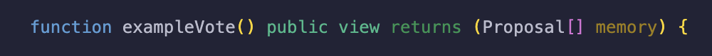

Ask RemixAI with //
---------------------------

With the AI Copilot enabled, start a comment with ``//`` to send a code request
directly from the Editor. Example:

::

   // write a function that returns an array with 3 elements from the function's parameters

Compilers: Explain Error
------------------------

In the error cards of both the Solidity Compiler and the Vyper Compiler, there is
an **Ask RemixAI** button that helps explain compiler errors.

Click the button to send the error message to RemixAI. The Assistant will explain
the cause of the error and suggest how to fix it.

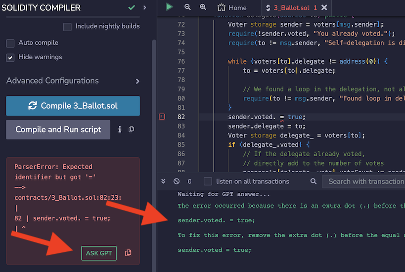