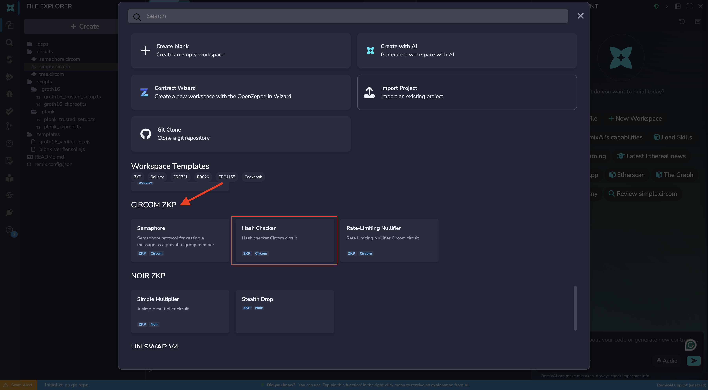
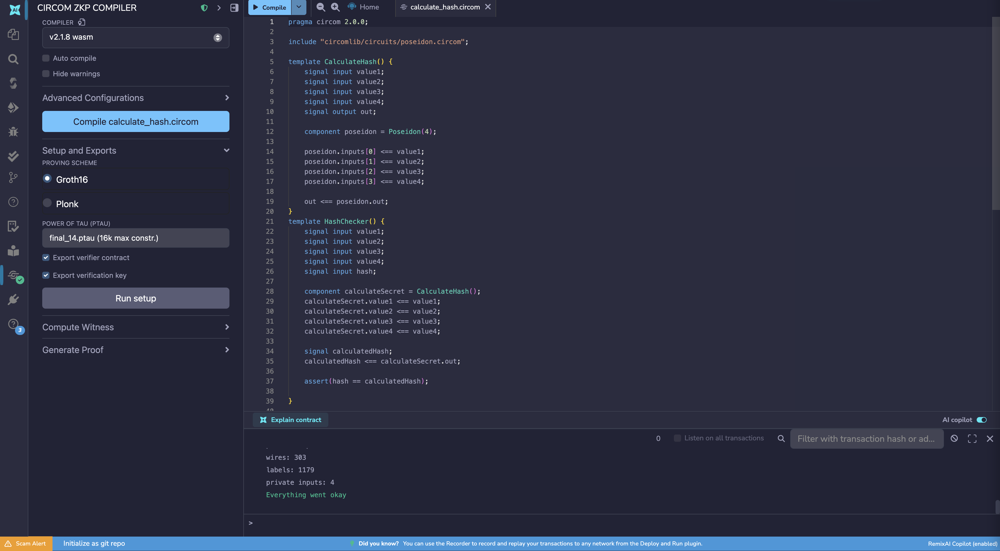
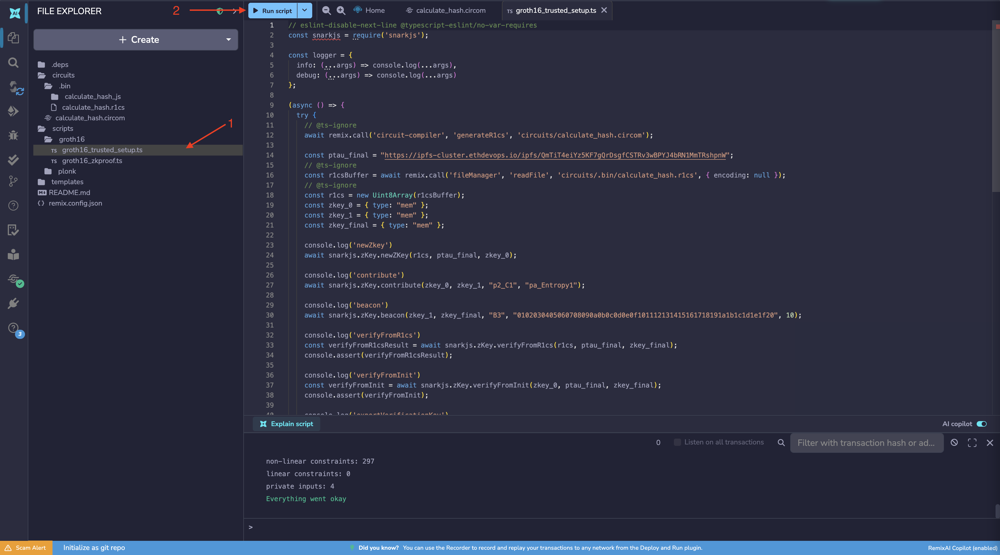
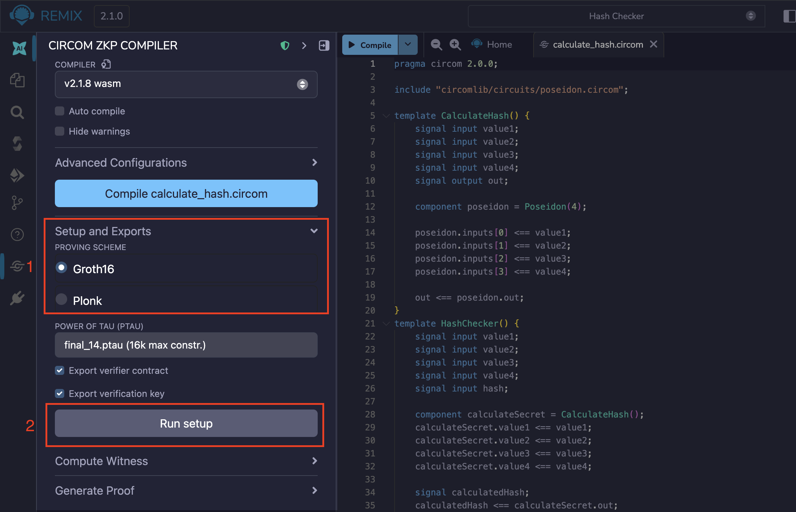
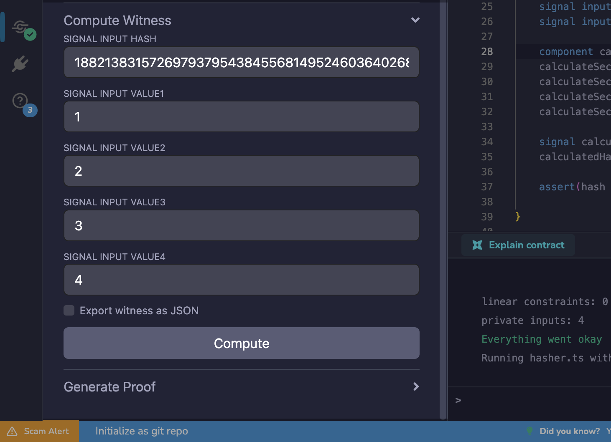

---
myst:
  html_meta:
    "description": "Write, compile, and test ZK circuits in Remix IDE using the Circom plugin to generate proofs and verify them on-chain or off-chain with no local setup required."
    "keywords": "circom, zero knowledge, zk proof, circom compiler, snarkjs, groth16, r1cs, witness, remix ide, zkp"
---

# Circom Compiler

Circom is a low-level language for writing ZK (zero-knowledge) circuits, programs that express computations as mathematical constraints, making them provable without revealing private inputs. The Remix Circom plugin brings the entire workflow into the browser, with no local setup required. This tutorial walks you through writing a circuit and verifying a proof using the **Hash Checker** template as a worked example.

## How it works

Generating a ZK proof in Remix involves three broad stages:

1. **Build the circuit**: You write your computation in Circom, compile it into a format the browser can execute, and generate the constraint file that defines the rules the computation must follow.

2. **Execute the circuit**: You provide your private inputs and compute the witness, the full record of how the circuit ran with those inputs. This is what you will eventually prove, without revealing the inputs themselves.

3. **Set up keys, generate, and verify the proof**: A one-time trusted setup produces the cryptographic keys tied to your circuit. Those keys, combined with the witness, are used to generate the proof. The proof is then verified either off-chain using a verification key, or on-chain using a generated Solidity contract.

Each step in this tutorial maps to one of these stages.

## Loading a Circom template

To load a Circom template, click the dropdown at the center of the Top Bar, and click the revealed "**Create new Workspace**" button. On the templates modal under "Workspace Templates", scroll till you find "Circom ZKP" and select the **Hash Checker** template.



This template contains `calculate_hash.circom` and the scripts needed to complete the full proof workflow in this tutorial. After generating the workspace, the Circom plugin will automatically be activated and its icon will appear in the Icon Panel.

## Step 1: Compile the Circuit

The browser and the snarkjs library that powers this plugin cannot work with `.circom` files directly; they need a binary format they can actually execute. Compilation translates your circuit into a `.wasm` (WebAssembly) file that can be run in the browser to compute values later in the workflow.

To compile:

1. Open `circuits/calculate_hash.circom` in the Editor so it is the active file
2. Go to the Circom plugin panel
3. Click **Compile calculate_hash.circom**

This generates `calculate_hash.wasm` in `circuits/.bin/calculate_hash_js`.



```{note}
The **Compile** button is disabled if the active file in the Editor is not a `.circom` file.
```

## Step 2: Generate the R1CS File

Your compiled circuit needs to be translated into a form the proving system can reason about mathematically. That form is the R1CS file. The proving system uses the R1CS file to check that a witness (your execution trace, generated in the next step) actually satisfies all the rules of the circuit. Without it, there is nothing to verify against.

This is also the point where you choose a **proving scheme**. The proving scheme defines the mathematics used to construct and verify your proof. The R1CS file itself is scheme-agnostic, but the cryptographic keys generated from it in a later stage will be tied to whichever scheme you choose here. This tutorial uses **Groth16**.

To generate the R1CS file tied to the Groth16 scheme, run the `scripts/groth16/groth16_trusted_setup.ts` script. Similarly, to tie the R1CS file to the Plonk scheme, run the `scripts/plonk/plonk_trusted_setup.ts` script.



This script generates `calculate_hash.r1cs` in `circuits/.bin/`.

Alternatively, you can click the **Run Setup** button on the Circom plugin with Groth16 selected to get the same result.



## Step 3: Compute the Witness

The proof does not directly prove your private inputs. It proves that you have a valid **witness**, a complete record of every value computed during the circuit's execution: your inputs, intermediate calculations, and the final output. Because the witness captures the full execution trace, it is impossible to fake a valid one by only providing the input and output. The prover never reveals their inputs, only this trace.

To compute the witness, expand the **Compute Witness** section in the plugin, enter your private input values, and click **Compute**.

You can use the values below:

```json
{
  "value1": "1",
  "value2": "2",
  "value3": "3",
  "value4": "4",
  "hash": "18821383157269793795438455681495246036402687001665670618754263018637548127333"
}
```



This generates `calculate_hash.wtn` in `circuits/.bin/`.

### Files Generated So Far

| File                  | Location         | Purpose                                           |
| --------------------- | ---------------- | ------------------------------------------------- |
| `calculate_hash.wasm` | `circuits/.bin/` | Compiled circuit, used to compute the witness     |
| `calculate_hash.r1cs` | `circuits/.bin/` | Constraint rulebook, used to validate the witness |
| `calculate_hash.wtn`  | `circuits/.bin/` | The witness itself, the input to proof generation |

These three files together represent the circuit and a single honest execution of it. The next step is generating the cryptographic keys that allow a proof to be constructed and verified.

## Generating a Proof Using Scripts

With the setup script complete, the following files are available in `zk/build/` for use in proof generation and verification:

| File                    | Location    | Purpose                                                |
| ----------------------- | ----------- | ------------------------------------------------------ |
| `verification_key.json` | `zk/build/` | Used to verify proofs off-chain                        |
| `zk_verifier.sol`       | `zk/build/` | Solidity contract for on-chain verification            |
| `zk_setup.txt`          | `zk/build/` | Stores the `zkey_final` reference for proof generation |

### Generating and Verifying the Proof

With the cryptographic keys generated by `groth16_trusted_setup.ts` in Step 2, this script performs the actual proof generation and verification using Groth16.

Verification takes the proof, the public signals, and the verification key, and confirms mathematically that the proof was correctly constructed from a valid witness, without running the circuit again or revealing the private inputs.

To run the script, open `scripts/groth16/run_verification.ts` in the Editor and click the **Run** button in the top bar. The script picks up the witness and keys produced in the previous steps, generates the proof, and verifies it in one pass.

The two core operations the script performs are:

```typescript
// Generate the proof and public signals from the witness and ZKEY
const { proof, publicSignals } = await snarkjs.groth16.prove(zkey_final, wtns);

// Verify the proof against the verification key and public signals
const verified = await snarkjs.groth16.verify(
  vKey,
  publicSignals,
  proof,
  logger,
);
```

The result appears in the Remix terminal. A successful verification prints:

```
> Checking witness correctness
WITNESS IS CORRECT
WITNESS CHECKING FINISHED SUCCESSFULLY
```
