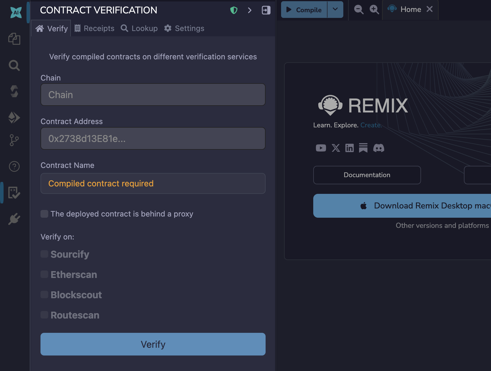
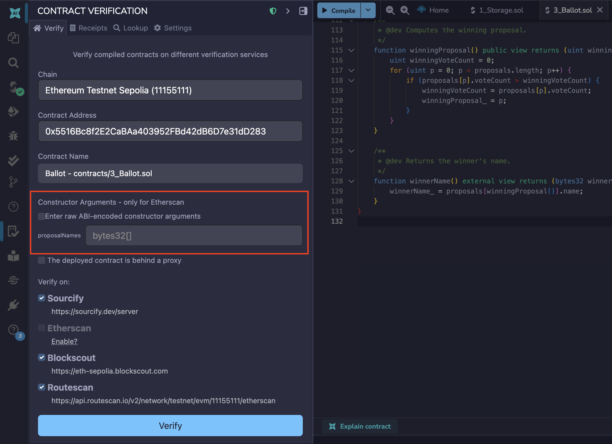
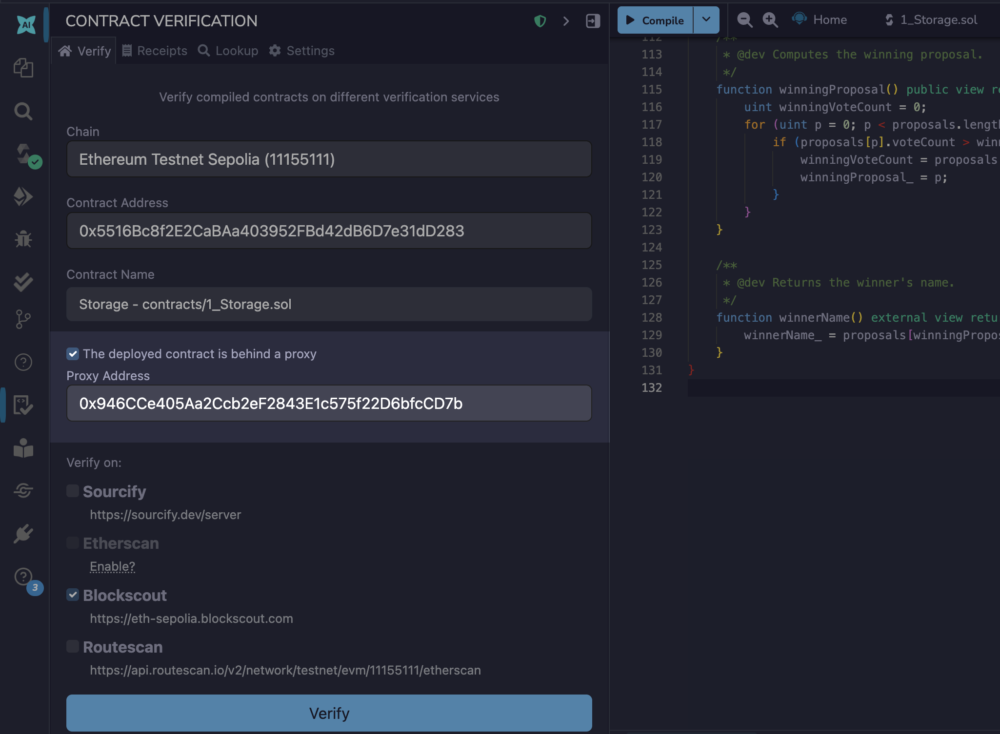
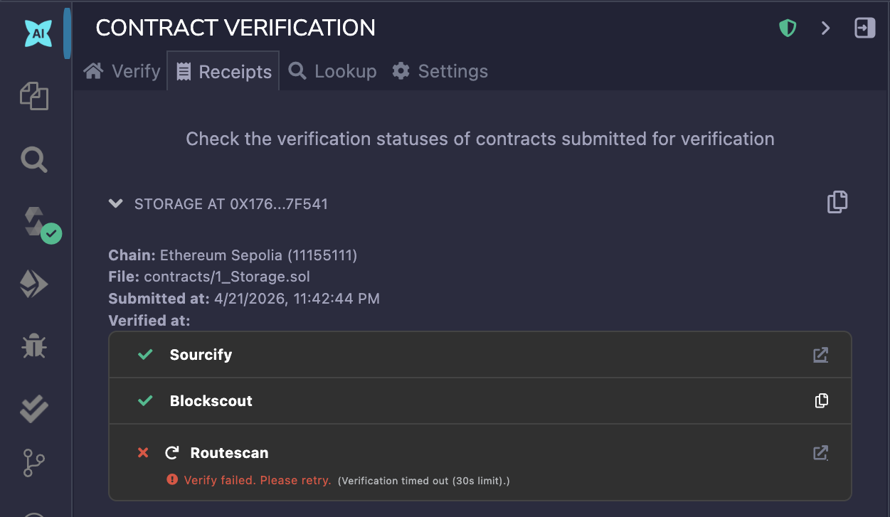
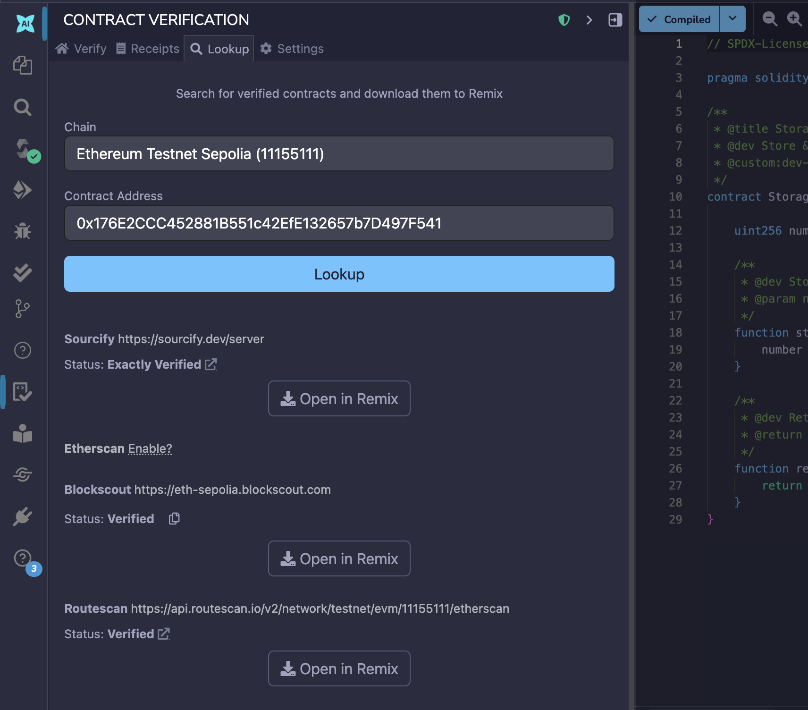
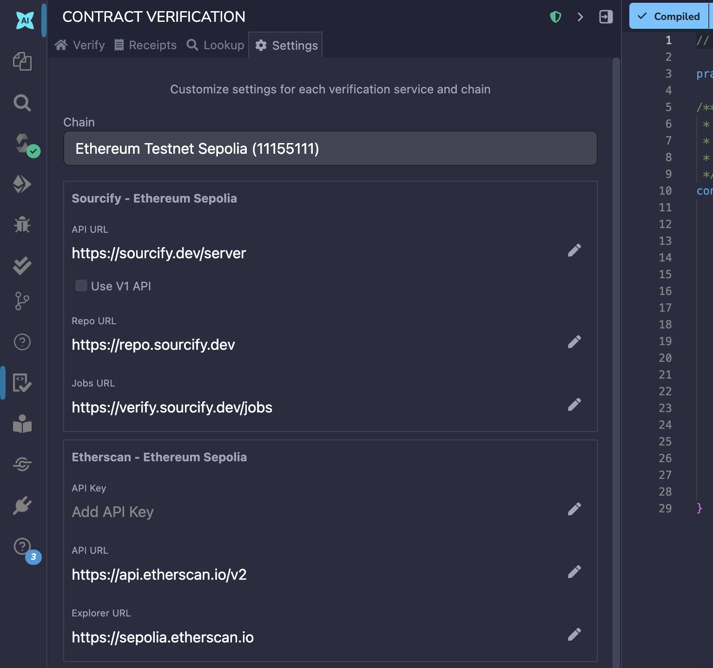
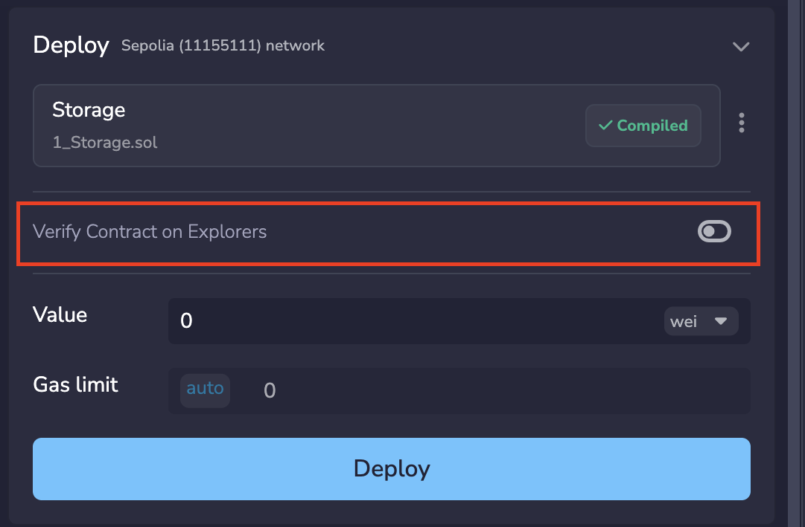

---
myst:
  html_meta:
    "description": "Verify deployed smart contracts on Sourcify, Etherscan, Blockscout, and Routescan directly from Remix IDE."
    "keywords": "contract verification, etherscan verify, sourcify, remix ide, smart contract"
---

# Contract Verification

Remix IDE includes a plugin for contract verification called "**Contract Verification**", available in the Plugin Manager. This plugin supports contract verification on Sourcify, Etherscan, Blockscout, and Routescan. The plugin has 4 tabs: the **Verify** tab, the **Receipts** tab, the **Lookup** tab, and the **Settings** tab. You can also verify contracts directly from the [Deploy and Run](#verifying-with-deploy-and-run) plugin.

## Verify tab

This is the home view of the plugin where you can verify your contracts.



To verify a contract, you need to have:

1. The address of a deployed contract on a public network.
2. The same contract source code compiled in Remix, using the same compiler version, optimization settings, and EVM version that were used during deployment.
3. Constructor arguments matching those used during deployment (if applicable).

With the above, you can select which verification services you want to use for your verification by checking their boxes. By default, all of them have valid configurations that allow you to verify without any setup. The only exception to this is verification using Etherscan on Ethereum Mainnet; this requires a valid [Etherscan API key](https://docs.etherscan.io/getting-started) which you can provide on the settings tab.

### Verifying with constructor arguments

When a contract has arguments in the constructor, a text field will appear where you can enter the constructor arguments used during deployment.



### Verifying a proxy contract

If your contract is behind a proxy, you can also verify the proxy with the implementation contract. You just need to check the "The deployed contract is behind a proxy" checkbox, and provide the address of the proxy contract.



The plugin will first verify the implementation contract, and then verify the proxy contract. Proxies can only be verified on Etherscan and Blockscout.

### Supported networks

The plugin supports hundreds of EVM-compatible networks. Notable examples include:

- Ethereum Mainnet and testnets (Sepolia, Holesky)
- Arbitrum One, Arbitrum Nova, Arbitrum Sepolia
- Base and Base Sepolia
- BNB Smart Chain Mainnet and Testnet
- Avalanche C-Chain and Fuji Testnet
- Optimism and OP Sepolia
- Polygon and Polygon Amoy
- Berachain, Blast, Celo, and many more

The full list of supported networks is available in the network dropdown inside the plugin.

## Receipts tab

Verification receipts are found on the receipts tab.



You can hover over the status symbols to get more information about failed verifications.

## Lookup tab

The Lookup tab is used to check if a contract is verified on the verification services, and to download its source code into the Remix file explorer.



## Settings tab

In the settings tab, you can configure custom API URLs for the verification services, and add your own API keys. For Etherscan, adding an API key is mandatory.



The settings are always stored per chain, meaning that if you change the settings for a chain, it will not affect other chains. However, the Contract Verification plugin uses the Etherscan v2 API, meaning the same API key will work for over 50 different chains.

```{important}
For the time being, you’ll still need to input your Etherscan v2 API key on each different chain, but at least it will be the same key for all of them.
```

## Verifying with Deploy and Run

You can also verify your contracts during deployment on the Deploy and Run plugin by checking the "Verify Contract on Explorers" checkbox before clicking **Deploy**.



When the checkbox is enabled, verification is automatically submitted to the configured verification services immediately after the contract is deployed. The verification uses the same service configuration set up in the Contract Verification plugin's [Settings tab](#settings-tab). Verification results can be found in the [Receipts tab](#receipts-tab) of the Contract Verification plugin.
