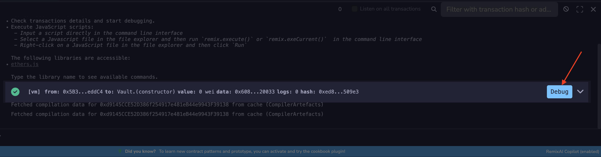
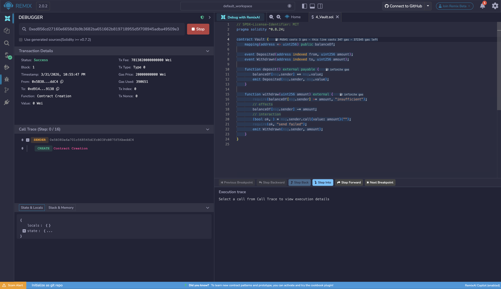
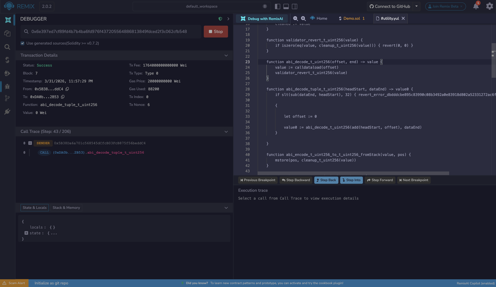
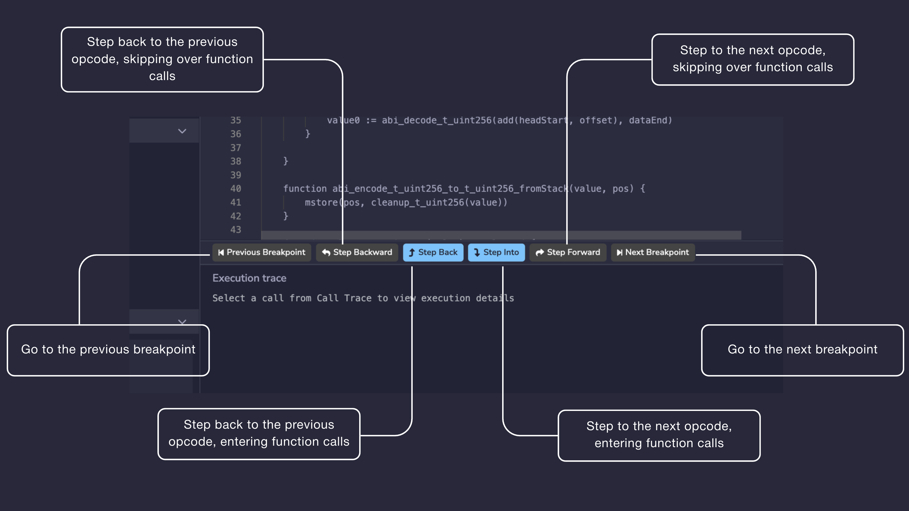
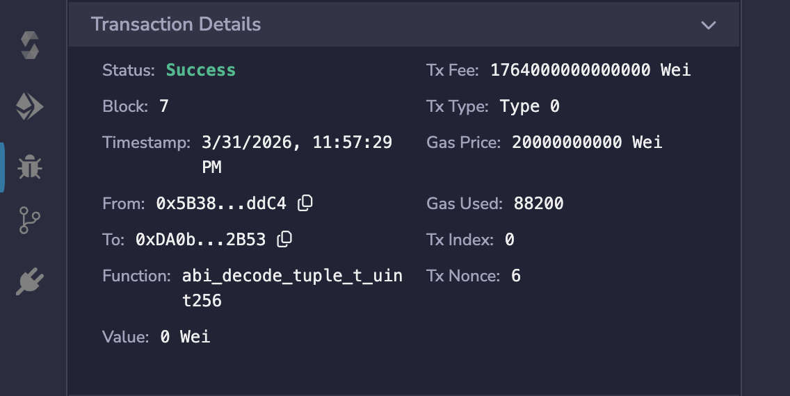
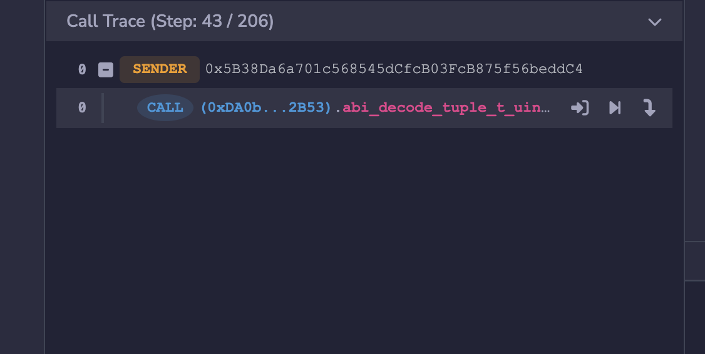
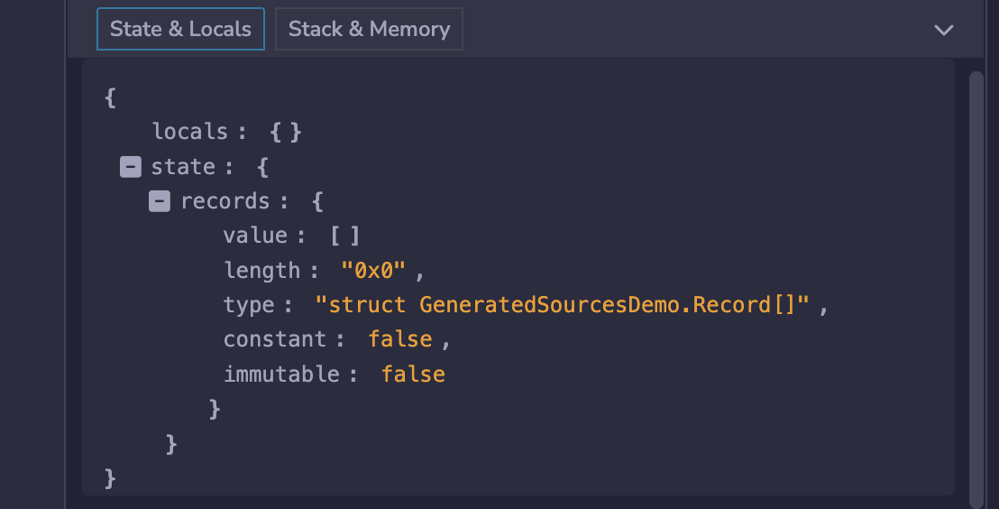
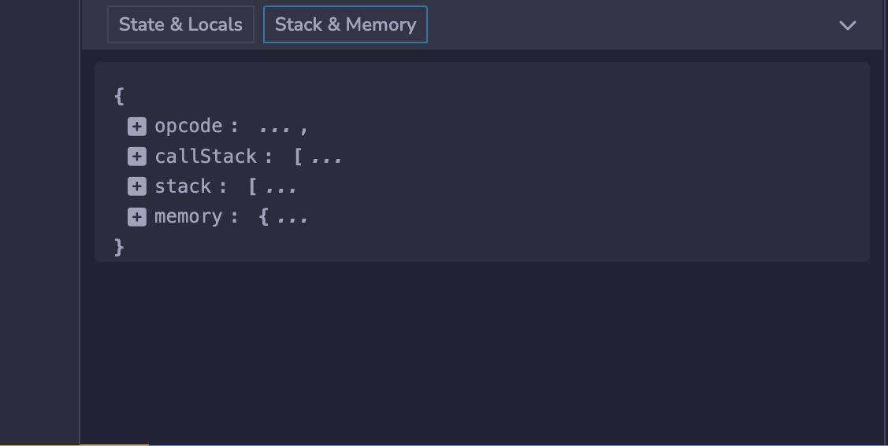
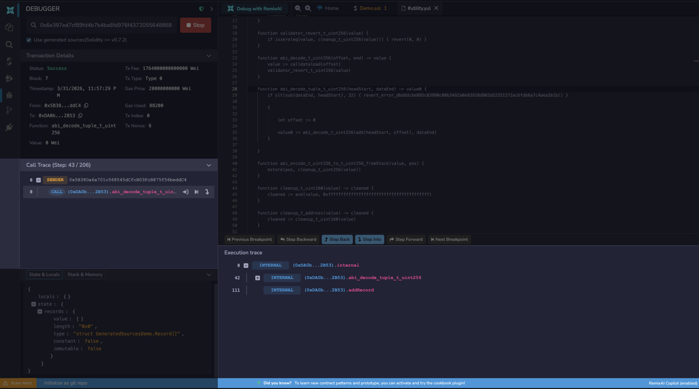

---
myst:
  html_meta:
    "description": "Step through Ethereum smart contract transactions in Remix IDE's debugger to inspect state, storage, and call stack at each step."
    "keywords": "remix debugger, smart contract debugging, transaction debugger, solidity debug"
---

# Debugger

The Debugger shows the contract's state while stepping through a transaction.

It can be used on transactions created in Remix or by providing a transaction hash. The latter requires either that you have the contract's source code compiled with the same settings as the deployed contract, or that the contract is verified on a block explorer.

## Starting a Debugging Session

There are two ways to start a debugging session.

The first is to click the **Debug** button next to a transaction in the Terminal. The Debugger will be activated and will gain focus in the **Side Panel**.

The second is to use the Debugger directly. **Activate** the Debugger in the Plugin Manager and then click the **bug icon** in the Icon Panel. Input a transaction hash (you must also have the contract's source code open in the editor), then click the button with the Play icon to start debugging.

The debugger will highlight the relevant code in the Editor. If you want to go back to editing the code without the Debugger's highlights, then click the button with the Stop icon.

To learn more about how to use this tool, go to the {doc}`Debugging Transactions </tutorial_debug>` page.

This page will go over the Debugger's _Use generated sources_ option, its navigation, and its panels.

## Use generated sources

When Solidity compiles a contract, it generates internal Yul routines (such as ABI encoding/decoding and overflow checks) that are embedded in the bytecode but are not part of your source code. By default, the debugger has no source to map these opcodes to and skips over them.

When **Use generated sources** is enabled, these routines are surfaced in a separate `.yul` file in the editor. The debugger can then step through every opcode in the transaction without gaps, including the compiler-generated ones. This is particularly useful when auditing contracts, as it gives complete visibility into what is actually executing.

This option requires Solidity 0.7.2 or greater.

## The Debugger's Navigation

The navigation buttons appear at the bottom of the editor when a debug session is active. They control how you step through the transaction's execution.

### Step Backward

Steps back to the previous opcode without entering function calls. If the previous step is inside a function call, the debugger will skip over it and land on the opcode before the call was made. Use this when you want to move backwards through execution without descending into the internals of every function along the way.

### Step Back

Steps back to the previous opcode and will enter function calls. If the previous step was inside a function, the debugger will follow execution back into that function. Use this when you need to trace execution backwards in full detail, opcode by opcode.

### Step Into

Advances to the next opcode and will enter function calls. If the next step involves a function call, the debugger will follow execution into that function. Use this when you want full visibility into what a function is doing rather than treating it as a black box.

### Step Forward

Advances to the next opcode without entering function calls. If the next step involves a function call, the debugger will skip over it and resume at the opcode after the call returns. Use this when you want to move forward through execution without stepping into every function.

### Previous Breakpoint

Moves the debugger back to the most recently passed breakpoint. Breakpoints are set by clicking a line number in the Editor. Use this to jump between points of interest without stepping through every opcode in between.

### Next Breakpoint

Moves the debugger forward to the next breakpoint ahead in the execution. If no further breakpoint exists, the debugger will not advance. Use this alongside **Previous Breakpoint** to navigate quickly through long transactions.

## The Debugger's Panels

### Transaction Details

The Transaction Details section is collapsible and appears at the top of the debugger panel. It shows metadata about the transaction being debugged, including:

- **Status**: whether the transaction succeeded or was reverted
- **Block** and **Timestamp**
- **From** and **To** addresses
- **Function** that was called
- **Value**, **Tx Fee**, **Gas Price**, **Gas Used**, **Tx Type**, **Tx Index**, and **Tx Nonce**

### Call Trace

The Call Trace shows the full call hierarchy of the transaction. The current step is shown in the header as **Step: X / Y**, where X is the current opcode step and Y is the total number of steps in the transaction.

Each entry in the trace shows the call type (e.g. **SENDER** or **CALL**), the address, and the function called. Each call entry also has three action icons that let you jump into the call, jump to its start, or jump to its end without stepping through every opcode manually.

### State & Locals

The **State & Locals** tab displays a JSON object with two keys:

- `locals`: the local variables in scope at the current execution step
- `state`: the state variables of the contract at the current execution step. Each variable is expanded to show its `value`, `type`, `length` (for arrays), `constant`, and `immutable` flags.

Each entry can be expanded or collapsed using the toggle next to it.

### Stack & Memory

The **Stack & Memory** tab displays a single JSON object with four keys, each expandable:

- `opcode`: the current opcode the debugger is on. Updates with each step.
- `callStack`: the call stack at the current step. It has a maximum size of 1024 elements and contains words of 256 bits.
- `stack`: the EVM operand stack at the current step. For more info about the [stack](https://en.wikipedia.org/wiki/Stack_(abstract_data_type)).
- `memory`: the EVM memory at the current step. Memory is cleared for each new message call, is linear, and can be addressed at byte level. **Reads** are limited to a width of 256 bits while **writes** can be either 8 bits or 256 bits wide.

### Execution Trace

The Execution Trace appears below the navigation buttons. Select a call from the **Call Trace** to load the step-by-step opcode trace for that call.

## Additional Info

The debugger is not only useful for fixing bugs. Its granular, step-by-step visibility into transaction execution makes it an excellent tool for understanding and auditing smart contracts.

To learn about using the debugger, go to {doc}`Debugging Transactions </tutorial_debug>`.
