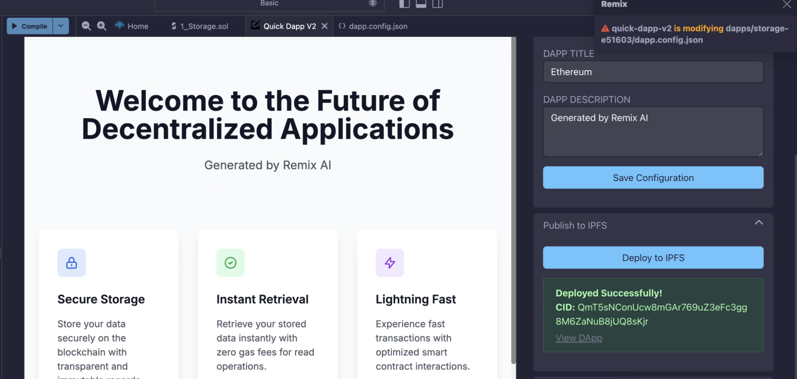
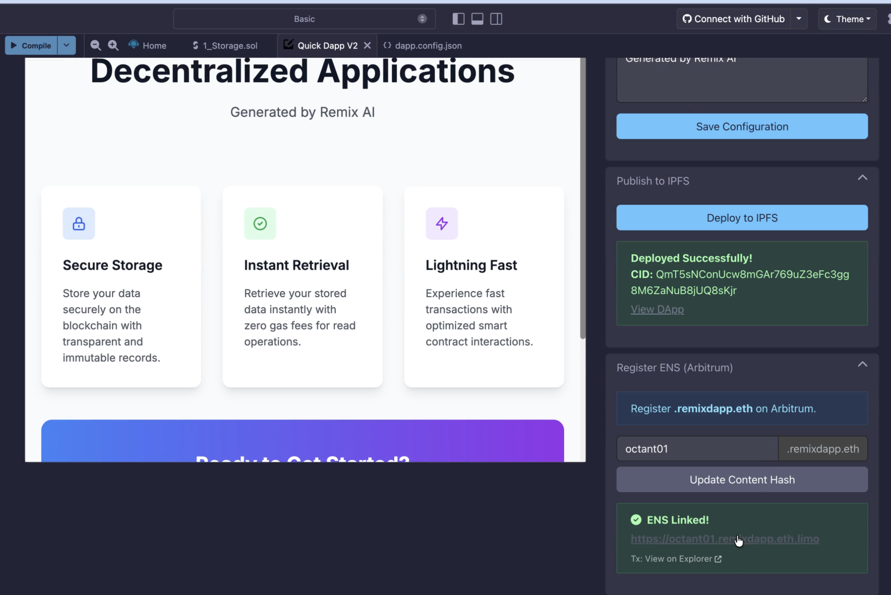

# Deploy a Dapp with IPFS & an ENS Domain

```{warning}
This feature is only available to beta testers. Join the Remix beta program to get access.
```

You can deploy Dapps generated by {doc}`QuickDapp </quickdapp>` on IPFS
(InterPlanetary File System) and link them to an ENS domain directly from Remix.

Remix automatically provides a free ENS subdomain under `remixdapp.eth` for
your Dapp with no gas fees required.

## Deploying to IPFS

Before you deploy to IPFS, you must have a smart contract compiled and deployed using the Deploy & Run plugin, and a Dapp generated by the QuickDapp plugin.

```{note}
When you are configuring rules for the Dapp generation, ensure that you leave the "**Create as Base Mini App**" checkbox unchecked.
```

After QuickDapp generates your Dapp, expand the "**Publish to IPFS**" tab in QuickDapp's right panel and click the "**Deploy to IPFS**" button. This bundles and uploads your files to IPFS. Once the upload is complete, a `CID` (Content Identifier) is returned. This is a unique address that identifies your Dapp on the network and is used as the target when registering the ENS subdomain.



## Register ENS Subdomain

Once your Dapp is on IPFS, you can link it to a human-readable ENS subdomain under `remixdapp.eth` (e.g. `myapp.remixdapp.eth`) so users can access it without needing the raw CID.

Registration transactions are processed on **Arbitrum One (L2)**, with gas fees covered by the Remix backend, so you pay nothing. Subdomain resolution on Mainnet uses the **CCIP-Read (EIP-3668)** standard, where the ENS Resolver fetches data from Arbitrum via a gateway server and returns a signed response.

To register the subdomain, expand the "**Register ENS (Arbitrum)**" tab in the QuickDapp right panel.

```{note}
This tab only becomes visible after the deployment to IPFS is complete.
```

Enter your preferred subdomain name (e.g., `bridge.remixdapp.eth`) and Remix will check its availability. Once you have selected an available subdomain, click the "**Register Subdomain**" button and wait for the server to process the registration.



```{note}
The returned URLs have `.limo` appended (e.g. `myapp.remixdapp.eth.limo`). This is because standard web browsers cannot natively resolve `.eth` domains. `.limo` is a gateway service that resolves ENS names and serves the underlying IPFS content over HTTPS.

```

Your Dapp is now live at https://[yourname].remixdapp.eth.limo.
