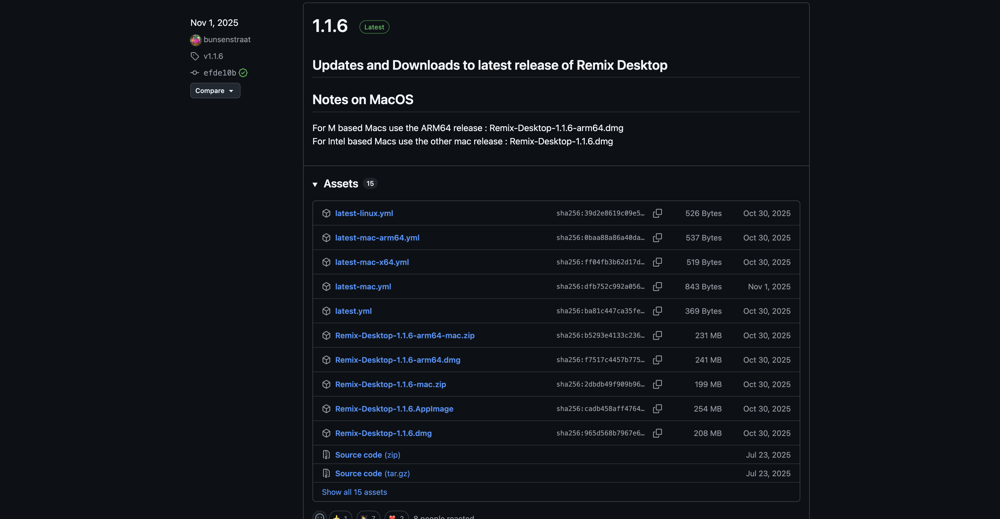
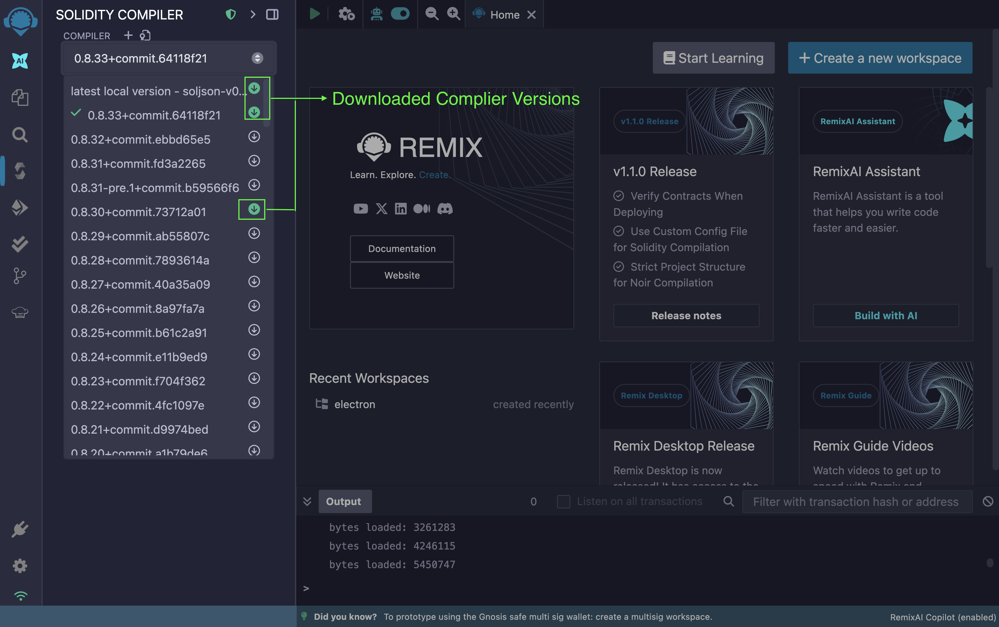

# Remix Desktop

Remix Desktop is a standalone desktop application that provides the same features as Remix IDE, with direct access to the local filesystem. It is available for macOS, Linux, and Windows, and supports running multiple instances simultaneously.

## Why Remix Desktop?

While the web version of Remix is perfect for quick experiments and learning, Remix Desktop is designed for local development workflows.

With Remix Desktop, you can:

- Work directly with local files and folders.
- Use Remix offline.
- Integrate smoothly with local tooling (Git, local nodes, scripts, native terminal).
- Maintain the same familiar Remix UI and plugins.

### Remix Desktop vs Remix online

| Feature                 | Remix Online | Remix Desktop |
| ----------------------- | ------------ | ------------- |
| Local filesystem access | Limited      | Full          |
| Offline support         | No           | Yes           |
| Installation required   | No           | Yes           |
| Plugin support          | Yes          | Yes           |
| User interface          | Same         | Same          |
| Git-friendly workflow   | Partial      | Full          |

## Installing Remix Desktop

Remix Desktop is available for macOS, Linux, and Windows. To install it for your operating system, visit the [Remix Desktop releases page](https://github.com/remix-project-org/remix-desktop/releases) and choose the installer for your operating system.

### macOS

Two builds are available on macOS:

- The arm64 build for Apple Silicon Chips (M1, M2, ...): If your system matches this build, download the installer named `Remix-Desktop-<version>-arm64.dmg`.
- The x64 build for Intel-based Macs: If your system matches this build, download the installer named `Remix-Desktop-<version>.dmg`.

### Linux

For most Linux distributions, Remix Desktop is provided as an AppImage. If you are on Linux download the file with `Remix-Desktop-<version>.AppImage`.

### Windows

On Windows, download the Remix Desktop installer (`.exe`) corresponding to your system architecture.

### Files you do not need to download

Some files in the release list are not intended for manual installation:

- `latest.yml`, `latest-mac.yml`, `latest-linux.yml`: These are update metadata files used by the auto-updater. You do not need to download this because Remix desktop prompts you to auto-update anytime there is a new update.
- `Source code (zip)` and `Source code (tar.gz)`: These are intended for building Remix Desktop from source. There is no need to download them unless you intend to build the desktop app from source.

## Working offline with Remix Desktop

Remix Desktop allows you to work offline with low or no internet connectivity. Most features work offline by default, but if you want to use multiple Solidity Compiler versions, you have to download them with an active internet connection.

To download a Solidity Compiler version, select it when you're online and Remix Desktop will automatically download it. Downloaded versions will remain available for offline use.

The offline/online indicator on the Icon Bar tracks your network and notifies you when you're online/offline.

## Using Remix Desktop with other IDEs

Remix Desktop accesses files directly from your file system allowing you to use your preferred IDE to write and edit code and use Remix for compiling, debugging, and testing.

## Using your native terminal in Remix Desktop

You can access your system's native terminal inside Remix Desktop. You can open the native terminal from the app’s menu bar by selecting **Terminal**.

## Using a browser wallet in Remix Desktop

Remix Desktop does not include a built-in wallet.

When you select **Injected Provider** (for example, MetaMask) in Remix Desktop, the connection is handled through your web browser:

- Remix Desktop opens your default browser automatically
- The browser navigates to a special local URL (for example, http://localhost:49589/)
- MetaMask displays a connection request in the browser

This local URL acts as a bridge between Remix Desktop and the browser wallet.

As a result, even though you are working in Remix Desktop, wallet interactions (such as signing transactions) are still performed in your browser via MetaMask.

## Hard drive security and performance

Remix Desktop leverages the power of your local hard drive, allowing it to handle larger Solidity contracts and more complex Circom and Noir circuits.

By running locally, Remix Desktop takes advantage of your machine’s storage and performance capabilities, enabling faster compilation and a smoother development experience compared to browser-based environments.
