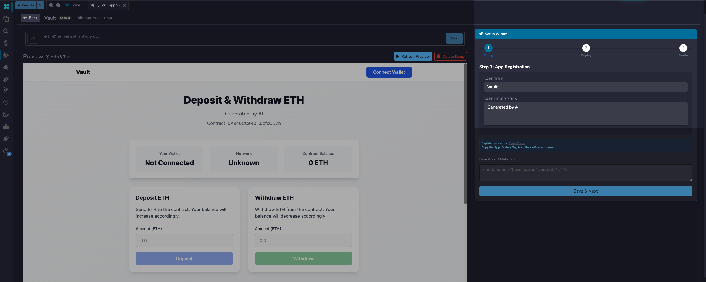
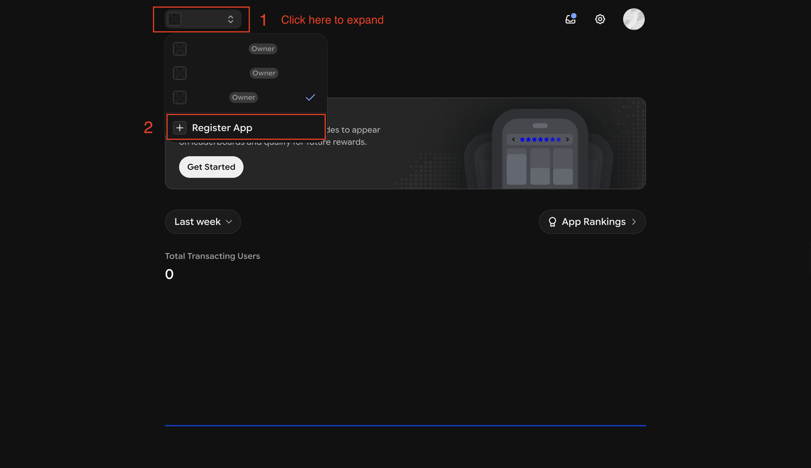
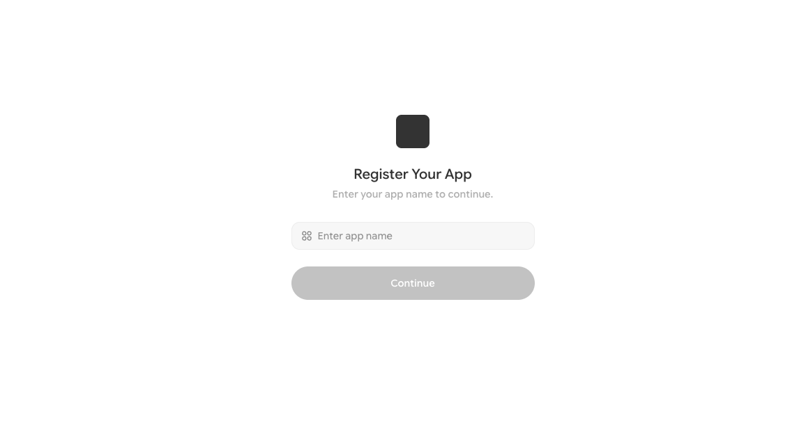
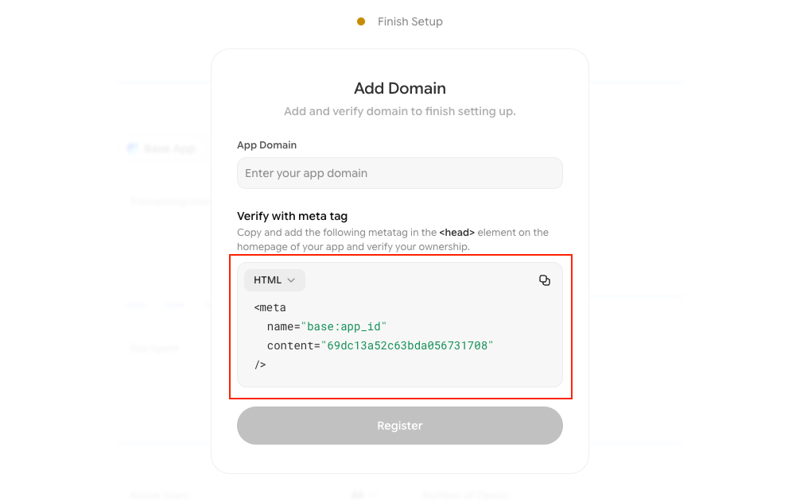
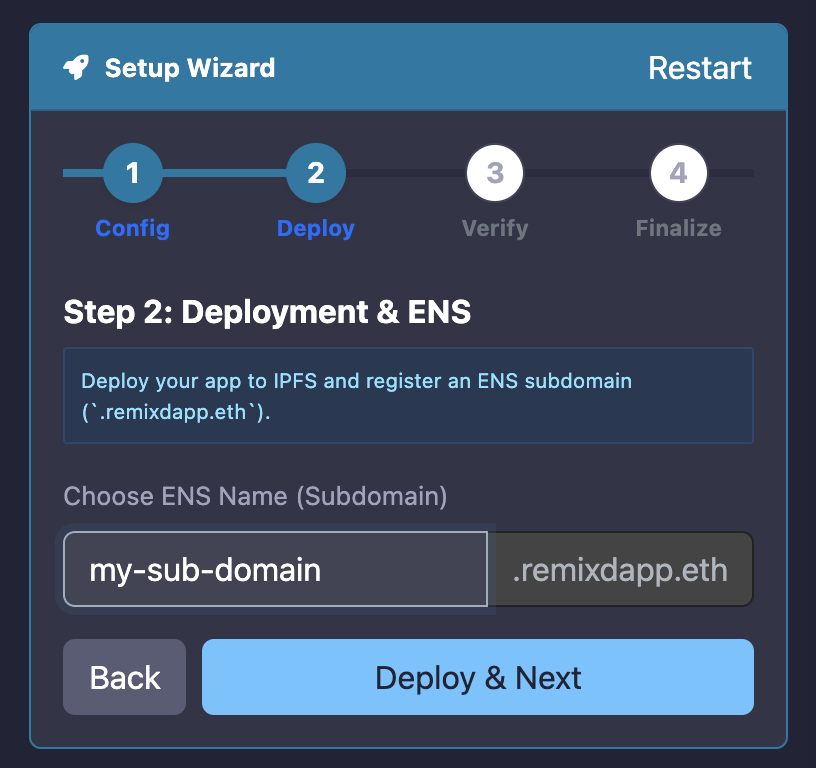
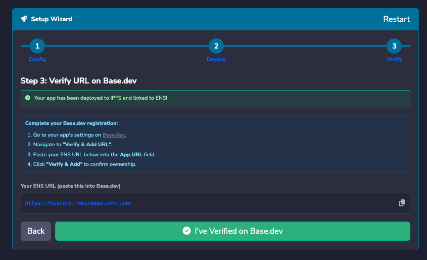

---
myst:
  html_meta:
    "description": "Deploy a QuickDapp-generated dApp as a Base mini app — register an ENS subdomain under remixdapp.eth and verify ownership through the Base Developer Portal."
    "keywords": "base mini app, farcaster frames, quickdapp, ens, remixdapp.eth, base developer portal, deploy dapp, remix ide"
---

# Deploy a Base Mini App

```{warning}
This feature is only available to beta testers. Join the [Remix beta program](https://forms.remix.live/f/3624097e2e21) to get access.
```

dApps generated by QuickDapp can also be deployed as Base mini apps. Deploying your dApp as a Base mini app allows you to embed it in Base App, making it instantly accessible to users without requiring them to visit an external site.

## Prerequisites

Before you can deploy your dApp as a Base mini app, you need the following:

- A smart contract compiled and deployed using the Deploy & Run plugin.
- A UI for your contract generated by {doc}`QuickDapp </quickdapp>`.

```{important}
When generating your dApp UI in QuickDapp, you **must** check the "**Create as Base Mini App**" box before clicking "**Generate**". Skipping this step will produce a standard dApp that cannot be registered as a mini app.
```

## Deploying as a Base mini app

On the preview page of the generated UI, you will find the Base mini app setup wizard on the left side of the screen.



The first tab on the setup wizard requires the Base App ID meta tag of an app. To get meta tags of an app, you have to create one on the [Base Developer Portal](https://www.base.dev/).

### Creating a Base app

To create a Base app, navigate to www.base.dev and log in. If you don't have any existing app you will be prompted to create your first app. If you have existing apps, you will be redirected to the dashboard of your latest app.

On the dashboard, click the app dropdown, and select "**Register new app**"



On the next page, name the app, and click "**Continue**", this will take you to the "Add Domain" page.





On this page, copy the meta tags, paste it in the setup wizard, and click "**Save & Next**".

```{note}
The App URL should be blank in this step, you will deploy and get the ENS domain in the next step.
```

### Registering an ENS domain

On the next tab, you will register an ENS subdomain for free under `remixdapp.eth`. Choose your preferred name, for example, `flashloan` -> `flashloan.remixdapp.eth` and click "**Deploy and Next**".

Before you register, choose your subdomain name carefully. Names are unique and first-come, first-served. Once registered, the name is permanently tied to your browser wallet address (MetaMask, Coinbase Wallet, etc.) and cannot be claimed or overwritten by any other wallet. If you already own the name, re-registering it will permanently replace the previous deployment.

For example, if you registered a voting dApp at `myvote.remixdapp.eth` and later register a token swap dApp under the same name, `myvote.remixdapp.eth` will resolve to the token swap dApp and the voting dApp will no longer be accessible at that address.



## Verifying ownership of the mini app

On the next tab you will see your dApp's deployed URL ending in `.limo`.

```{note}
`.limo` is a gateway service that resolves ENS domains to websites.
```



Copy the URL and paste it in the App URL field on the Base Developer Portal and click "**Register**". This will take you to your app's dashboard.

Go back to Remix and click the "**I've Verified on Base.dev**" button. Your dApp is now accessible on the Base app.


