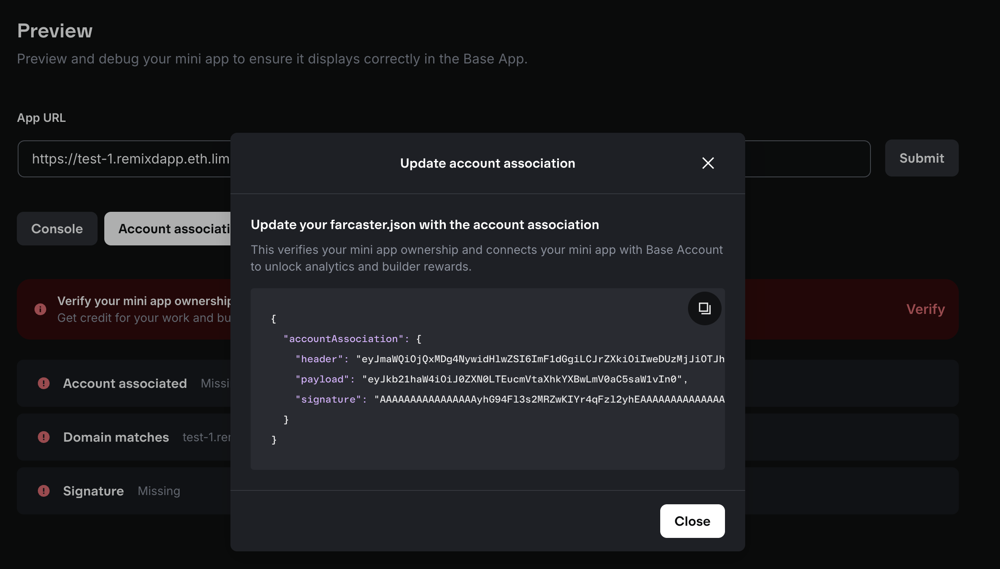
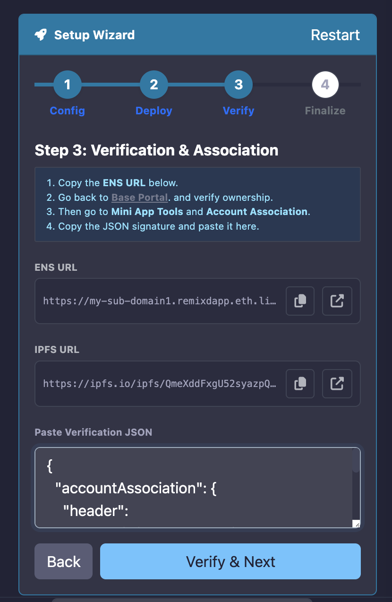

# Deploy a Base Mini App

```{warning}
This feature is only available to beta testers. Join the Remix beta program to get access.
```

Dapps generated by QuickDapp can also be deployed as Base Mini Apps (Farcaster Frames). Deploying your Dapp as a Base Mini App allows you to embed it in Base App and Farcaster feeds, making it instantly accessible to users without requiring them to visit an external site.

## Prerequisites

Before you can deploy your Dapp as a Base Mini App, you have to have the following:

- A smart contract compiled and deployed using the Deploy & Run plugin.
- An app created on the [Base Developer Portal](https://www.base.dev/).
- A UI for your contract generated by {doc}`QuickDapp </quickdapp>`.

```{important}
When generating your Dapp UI in QuickDapp, you **must** check the "**Create as Base Mini App (Farcaster Frame)**" box before clicking "**Generate**". Skipping this step will produce a standard Dapp that cannot be registered as a Mini App.
```

## Deploying as a Base Mini App

On the preview page of the generated UI, you will find the Base Mini App setup wizard on the left side of the screen.


The first tab on the setup wizard requires a Base App ID meta tag. You can get this by navigating to the [Base Developer Portal](https://www.base.dev/)


Copy the meta tags, paste it in the setup wizard, and click "**Save & Next**".

```{note}
The App URL should be blank in the step, you will deploy and get the ENS domain in the next step.
```

### Registering and ENS domain

On the next tab, you will register an ENS subdomain for free under `remixdapp.eth`. Choose your preferred name, for example, `flashloan` -> `flashloan.remixdapp.eth` and click "**Deploy and Next**".


## Verifying ownership of the mini app

On the next tab you will see your Dapp's deployed URL ending in `.limo`.

```{note}
`.limo` is a gateway service that resolves ENS domains to websites.
```

Copy the URL and paste it in the App URL field on the Base Developer Portal and click "**Verify & Add**".

Once verified, a modal containing an Account Association JSON code will pop up.



Copy it and paste it into the provided field on the setup wizard. Click "**Verify & Next**"


