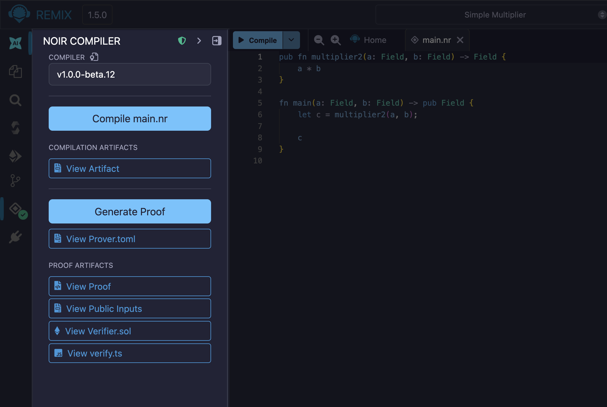

Using the Noir Compiler Plugin in Remix
=======================================

Noir lets you build zero-knowledge applications without writing cryptographic circuits. This guide covers the entire workflow of using the Noir Compiler plugin in Remix IDE to compile Noir code, generate a zero-knowledge proof, and verify the generated proof using a Solidity smart contract and a js script.

Creating a Noir workspace
-------------------------

To create a Noir template, click the **"Create a new workspace"** button in the top center of the screen
and scroll to find the **"Noir ZKP"** template and click **"Create"**. This will create a new workspace with the necessary ``Nargo.toml`` and ``src/main.nr`` files.

.. video:: ./images/noir/remixxnoir-template.mp4
  :nocontrols:
  :autoplay:
  :playsinline:
  :muted:
  :loop:
  :width: 100%

After generating the workspace, the Noir Compiler Plugin will automatically be activated and the icon will appear on the Icon Panel.

Compiling Noir circuits
-----------------------

Selecting the ``main.nr`` file will activate the **"Compile"** button. When you click the button the plugin starts the compilation process by zipping the project files and sending them to the compiler's backend.
On the backend, the server runs ``nargo compile`` and on successful compilation creates/overwrites two files in your workspace:

- ``build/program.json``: The compiled circuit artifact (ACIR/ABI).
- ``Prover.toml``: A template file for providing inputs needed for proof generation.

Once the compilation process is complete, a **"Compilation Artifacts"** section appears on the Noir Compiler Plugin page showing a **"View Artifact"** button. The **"Generate Proof"** button is activated.

If a compilation error occurs during this process, the error message will be displayed in the feedback window below the **"Compile"** button.

.. video:: ./images/noir/noir-compile.mp4
  :nocontrols:
  :autoplay:
  :playsinline:
  :muted:
  :loop:
  :width: 100%

Setting circuit inputs
----------------------
If your circuit requires inputs (private or public), you must edit the ``Prover.toml`` file before generating a proof. 
In the file, fill in the required input values in the ``[inputs]`` section and save the file (e.g., ``a = "1"``, ``b = "2"``).

.. video:: ./images/noir/edit-inputs.mp4
  :nocontrols:
  :autoplay:
  :playsinline:
  :muted:
  :loop:
  :width: 100%

Generating zero-knowledge proofs
--------------------------------

Once the inputs are set, click the **"Generate Proof"** button. Similar to the compilation process, the plugin zips the entire project, including the ``Prover.toml``, and sends it to the backend.
The backend runs ``nargo execute`` to generate a witness, then uses the proving library (bb.js) to generate the proof and related artifacts.

The plugin receives a zip file and extracts the following files into your workspace:
  - ``build/proof``: The formatted hexadecimal proof for use in UI and Solidity.
  - ``build/public_inputs``: The formatted JSON array of public inputs.
  - ``contracts/Verifier.sol``: A Solidity smart contract for verifying the proof.
  - ``scripts/verify.ts``: A JS script for verifying the proof in Remix.

On the plugin UI, the **"Proof Artifacts"** section appears along with buttons to view the four main generated files ("View Proof", "View Public Inputs", "View Verifier.sol", "View verify.ts").

Verifying proofs
----------------

Once the proof is generated, you can verify it in two ways.

On-Chain verification (with Solidity)
^^^^^^^^^^^^^^^^^^^^^^^^^^^^^^^^^^^^^
Follow the steps below to verify your proof on-chain using Solidity:

1. In the Noir plugin, click **"View Verifier.sol"** to open the verifier contract.
2. Go to the **"Solidity Compiler"** plugin in Remix, open **"Advanced Configurations"**, and check **"Enable optimization"**. Compile ``Verifier.sol``.
3. Go to the **"Deploy & Run Transactions"** plugin and deploy the ``HonkVerifier`` contract.
4. Find the ``verify`` function on the deployed contract.
5. Go back to the Noir plugin, click **"View Proof"**, and copy the entire ``0x...`` hexadecimal string. Paste it into the ``_proof`` parameter of the ``verify`` function.
6. Click **"View Public Inputs"**, copy the entire ``["0x...", ...]`` JSON array string, and paste it into the ``_publicInputs`` parameter.
7. Execute the ``verify`` transaction (call). If it returns ``true``, the verification is successful.

.. video:: ./images/noir/verify-proof.mp4
  :nocontrols:
  :autoplay:
  :playsinline:
  :muted:
  :loop:
  :width: 100%

Off-Chain verification (with JS Script)
^^^^^^^^^^^^^^^^^^^^^^^^^^^^^^^^^^^^^^^
Follow the steps below to verify your proof off-chain using JavaScript:

1. In the Noir plugin, click **"View verify.ts"** to open the verification script.
2. Click the **dropdown arrow** next to the **"Run script"** button in the editor's top bar.
3. Select **"Open script configuration"** from the menu.
4. In the configuration panel or modal, set the **"Execution environment"** to **"Noir"**.
5. Close the configuration window and click the main **"Run script"** button to execute the script.

.. video:: ./images/noir/verify-proof-js.mp4
  :nocontrols:
  :autoplay:
  :playsinline:
  :muted:
  :loop:
  :width: 100%