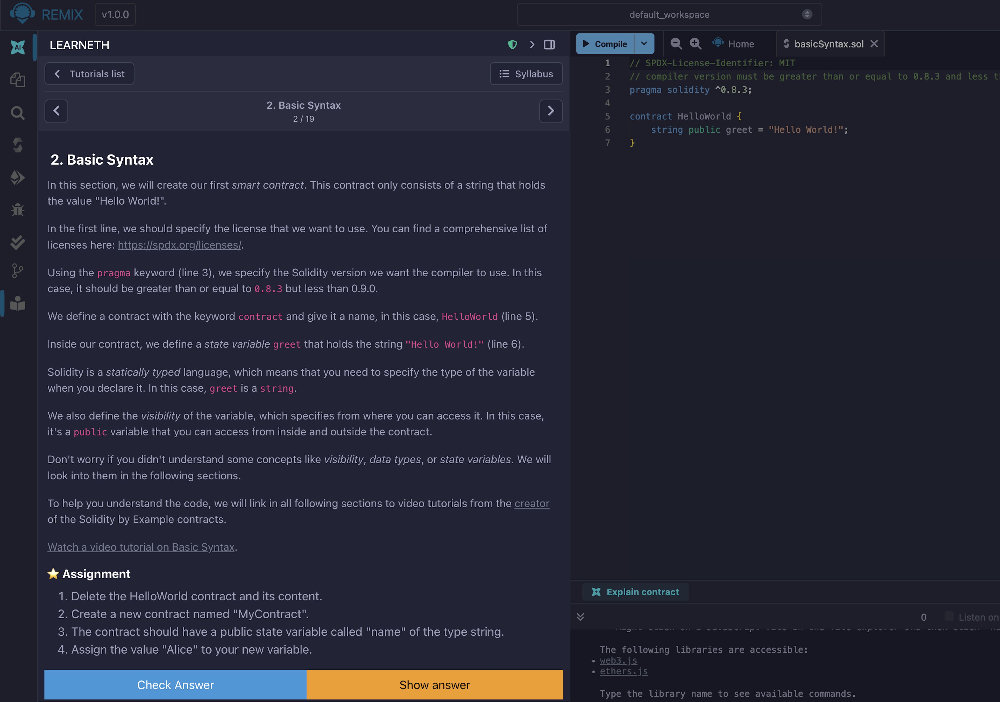
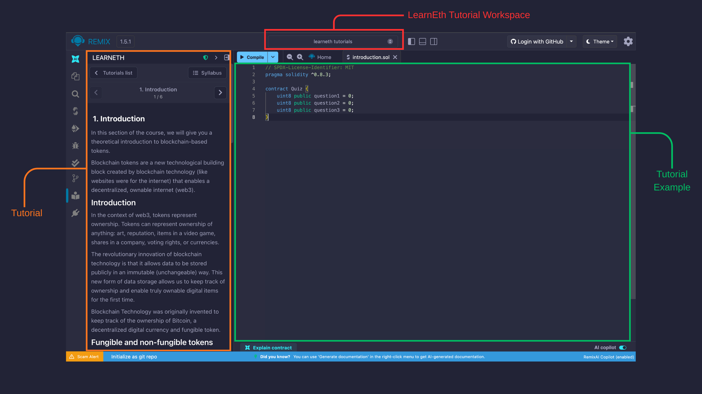

# Tutorials in Remix

You can do tutorials around blockchain development on Ethereum using the **LearnEth** plugin, a tutorial platform integrated into Remix.

Some tutorials contain quizzes run by the Solidity Unit Tests plugin to test how much you learned from the tutorial.



The tutorials contain `.md` files for instructions and can also contain example files, Solidity Unit Test files for quizzes, as well as answer files for quizzes and when you finish a tutorial, it will be marked "Completed".

## Using the LearnEth Plugin

To open LearnEth, you need to activate the LearnEth plugin in the Plugin Manager. Alternatively, you can activate it by clicking the link below which automatically opens the Remix IDE with LearnEth enabled.

```text
https://remix.ethereum.org/?#activate=udapp,solidity,LearnEth
```

```{tip}
For other tricks about Remix URLs with parameters, visit {doc}`locations. </locations>`

```

When you open a LearnEth tutorial, the example files associated with it will be loaded into a new Workspace called "LearnEth Tutorials".




### Loading LearnEth with Other Repositories

We have a growing set of tutorials on our default LearnEth content source. However, anyone can build tutorials on their own repos load them in the LearnEth plugin and it would work as it if were our default content source.


```{important}
Your repository must follow the LearnEth conventions to work on LearnEth. Learn how to [create your own LearnEth tutorials](https://remix-learneth-plugin.readthedocs.io/en/latest/index.html).
```

### Useful LearnEth Links

- LearnEth Plugin source code: [LearnEth Plugin repo](https://github.com/bunsenstraat/remix-learneth-plugin/)
- Default LearnEth content source: [Remix Workshops repo](https://github.com/ethereum/remix-workshops)
