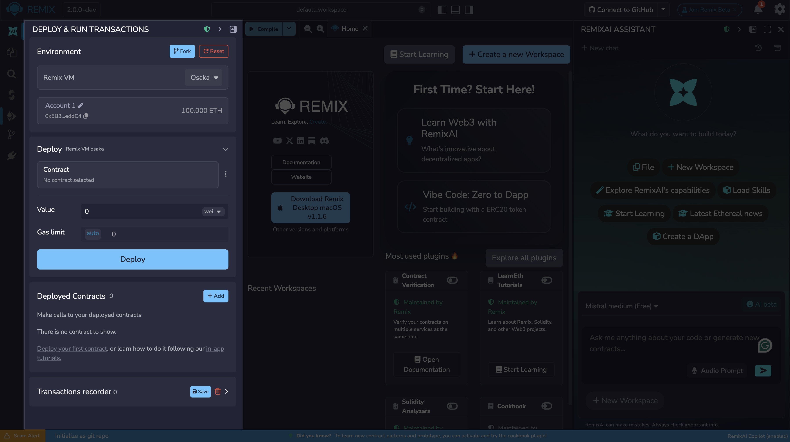
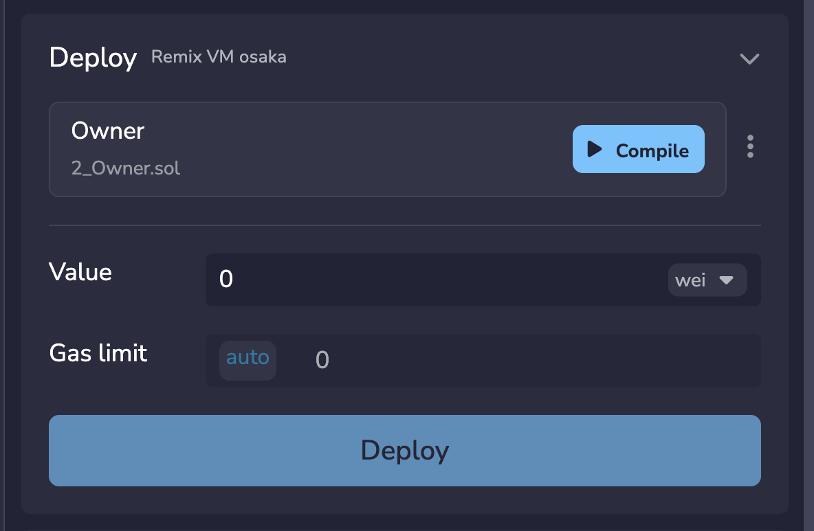
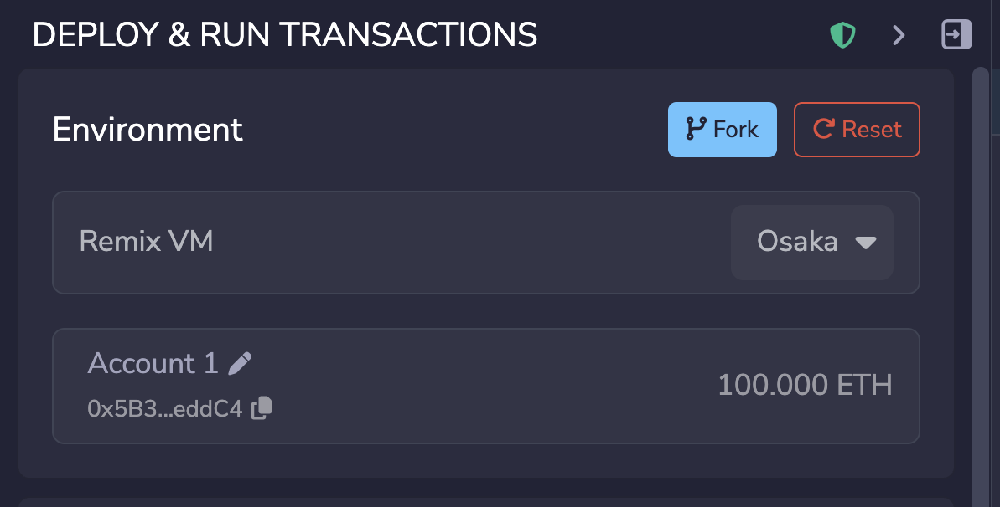
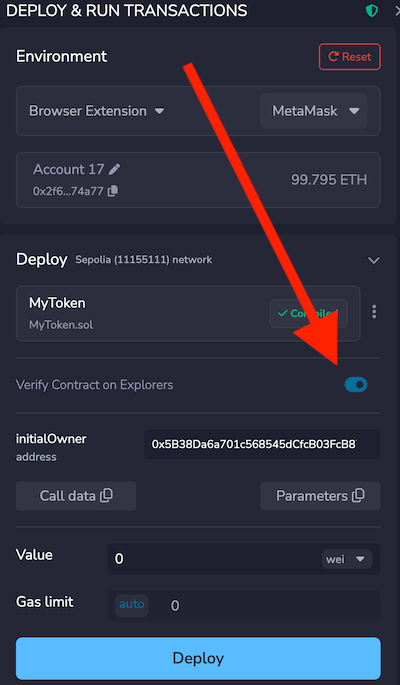
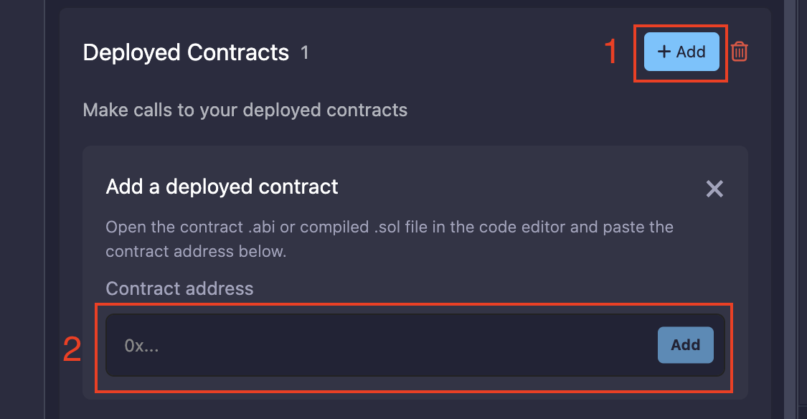
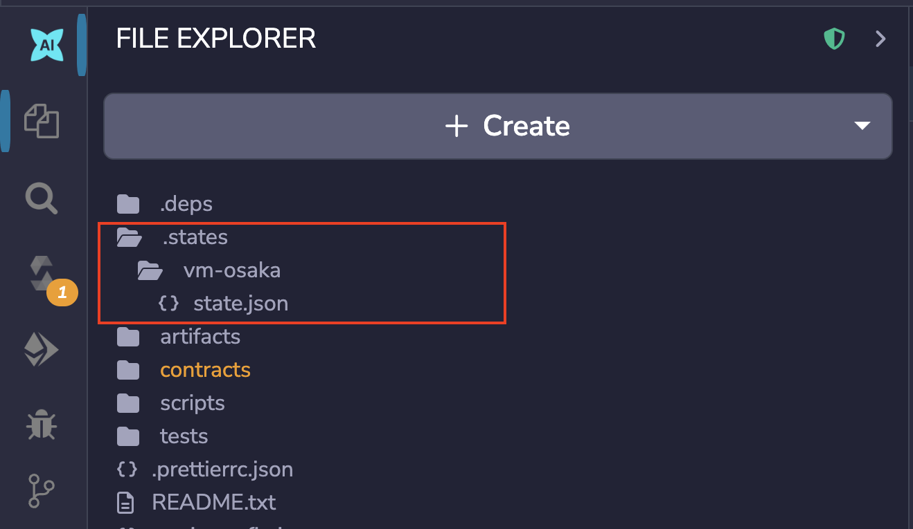
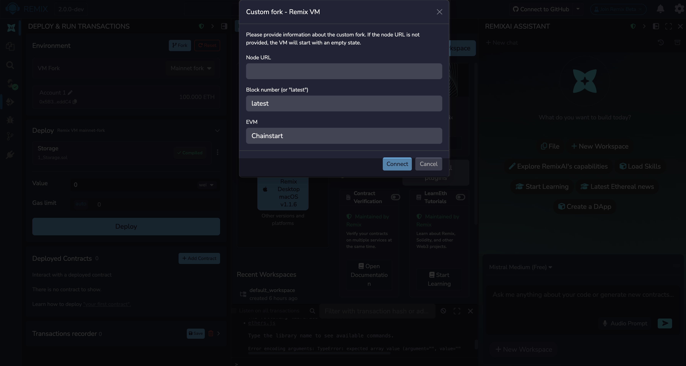
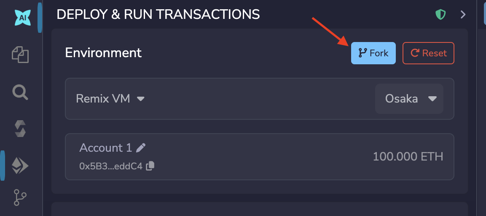
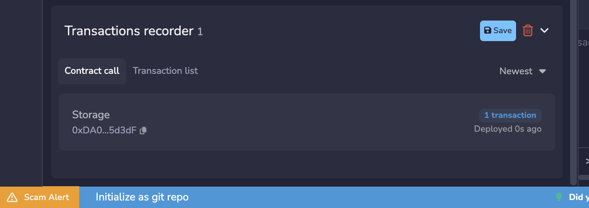

---
myst:
  html_meta:
    "description": "Deploy and interact with smart contracts in Remix IDE using multiple environments including the Remix VM, Browser Extension, WalletConnect, and custom RPC endpoints."
    "keywords": "remix deploy, run module, remix vm, browser extension, walletconnect, deploy contracts, hardhat, foundry"
---

# Deploy & Run

The Deploy & Run module is for sending transactions to the current **Environment**.

The three main actions of the Deploy & Run module are:

1. **Deploying** a contract
2. **Accessing** an onchain contract
3. **Interacting** with the functions of a deployed contract

This documentation page will cover **Deploying** and **Accessing**. Interacting will be covered in {doc}`Deploy & Run part 2 </udapp>`.



## Deploying a contract

To deploy a contract, it must first be compiled. There are three ways you can compile a contract:

1. You can compile your contract directly from the {doc}`Solidity Compiler plugin </compile>`. This allows you to configure the compiler's behavior, including the Solidity version, optimization settings, and EVM target before compiling.
2. You can use the "**Compile**" button that appears in the main panel when you have an active Solidity file. The compilation uses the configuration from the Solidity Compiler plugin, applying whatever settings were last saved there.
3. You can compile directly from the Deploy & Run plugin using the "Deploy" section. It displays a list of the contracts active in the editor, along with a "**Compile**" button that compiles using the settings stored in the Solidity Compiler plugin.



Once you have compiled and selected your contract, choose the chain for deployment and/or method for deployment, deployment wallet, and EVM version in the **ENVIRONMENT** section.



```{note}
If you want to connect Remix with a browser wallet (e.g., MetaMask,
Phantom), set your environment to **Browser Extension** and choose your preferred wallet/chain.

```

Before clicking **Deploy**, you can configure two additional fields:

- **Gas Limit**: Sets the maximum amount of gas allowed for the deployment transaction. Remix pre-fills a sensible default, but you can increase it if your contract is complex or if the deployment reverts due to an out-of-gas error.
- **Value**: The amount of ETH (or WEI, Gwei, etc.) sent along with the deployment transaction. Only relevant if your contract has a payable constructor. Otherwise, leave it at 0.

Clicking "**Deploy**" sends a transaction that deploys the selected contract. When
the transaction is mined, the newly created instance will be added
(this might take several seconds) to the "**Deployed Contracts**" section.

```{note}
If the contract's constructor function has parameters, you will need to specify them.
```

## Verifying on deployment
When connected to a public network, there is a switch to enable contract verification.



The contract's source-code and metadata will be submitted to Etherscan, Sourcify, Blockscout, and Routescan.  For the verification to go through on Etherscan, their API needs to be input either in the Remix Settings panel or in the Contract Verification plugin's Settings tab.  Verification can also be done using the Contract Verification plugin.

## Loading deployed contracts

If a contract has already been deployed, you can load it into Remix using the "**Add Contract**" button on the **Deployed Contracts** section.
Adding an already deployed contract costs no gas, since no redeployment is required. To load a deployed contract:

1. Make sure the contract's source code or ABI is in the active tab of the Editor. If using source code, it must be compiled with the same settings as the originally deployed contract.
2. Enter the deployed contract's address in the contract address field that appears when you click the "**Add Contract**" button.
3. The contract instance will appear in the **Deployed Contracts** list, ready to interact with.



```{warning}
Only load contracts from addresses you trust.
```

### Using the ABI to load contracts

If you don't have the source code but have the contract's **ABI**, you can still load and interact with it.

The ABI is a JSON array that describes a contract's functions, inputs, and outputs. To use it:

1. Create a new file in Remix with a `.abi` extension and paste the ABI content into it.
2. Make sure this file is the active tab in the Editor.
3. Enter the contract address in the **Contract address** field and click the "**Add**" button. The contract will appear in the **Deployed Contracts** list.

```{note}
To get the ABI of a contract you've compiled, open the Solidity Compiler plugin, compile the contract, then click **Compilation Details**. The ABI is listed in the modal that appears.
```

## Supported Environments

The Deploy & Run plugin supports several environments that determine where your transactions are sent and how they are signed. You can choose between an in-browser sandbox (including forked chains), a browser wallet, a mobile wallet, or a locally running node.

### Remix VM

The Remix VM is a sandbox blockchain in the browser. Transactions do not require an approval to run. Remix VM comes with 10 accounts, each loaded with 100 ETH.

The Remix VM supports multiple EVM forks letting you simulate different network conditions without connecting to a live chain.

The **state** of the Remix VM chain is saved in the **.states folder** in the File Explorer. If you do not want the Remix VM state to be saved, uncheck **Save environment state** in the Settings panel.

Saving the state means you can refresh the browser and not lose your work, the caveat being that browser storage is inherently unstable. Of course if you push to a remote repo, then you are not relying on the browser to save your work.

<!-- TODO: Add info about cloud storage after beta -->

In collaborative workflows, sharing the state of the Remix VM is a great way to work out bugs. Just have your teammates load the **state.json** file into their instance of Remix.



### Browser Extensions

Browser extensions allow you to connect Remix to a wallet installed in your browser, such as **MetaMask** or **Phantom**. This is the standard way to deploy contracts to a live network or testnet using your own accounts.

To use a browser extension:

1. Install a supported wallet extension e.g., MetaMask. (This option will not be visible if you do not have an extension installed).
2. Set the **ENVIRONMENT** to **Browser Extension** in the Deploy & Run panel.

Transactions sent through a browser extension require approval in the wallet popup before they are broadcast to the network.

```{note}
Make sure your wallet is unlocked and set to the correct network before deploying.
```

### Mobile Wallets (Wallet Connect)

WalletConnect allows you to connect Remix to a wallet on your mobile device by scanning a QR code. This is useful when you want to sign transactions with a hardware-backed or mobile wallet rather than a browser extension.

To use WalletConnect:

1. Set the **ENVIRONMENT** to **WalletConnect**.
2. A QR code will appear, scan it with your mobile wallet app (e.g., MetaMask Mobile, Rainbow, Trust Wallet).
3. Approve the connection in your wallet. Remix will then use your mobile wallet's accounts and selected network.

Transactions triggered in Remix will appear as signing requests on your mobile device.

### VM Forks

The Remix VM can fork a live network, loading its state into the in-browser sandbox. This lets you test contracts against real on-chain data (such as existing token balances, deployed protocols, or mainnet contract state) without spending real ETH.

The following fork options are available:

- **Mainnet fork**: Forks the Ethereum mainnet at the latest block.
- **Sepolia fork**: Forks the Sepolia testnet, useful for testing against testnet deployments.
- **Custom fork**: Forks any EVM-compatible chain at a block number of your choice. See [Custom Fork](#custom-fork) below.

Forked environments come pre-loaded with the same 10 accounts and 100 ETH per account as the standard Remix VM, but all existing on-chain state is accessible.

#### Custom Fork

The Custom fork option allows you to specify a chain’s RPC server, a block number, and an EVM version.



You can get the **Node URL** from chainlist.org. If the chain does not load, you may need to choose a different RPC server. You will also need to choose an EVM version appropriate to the block number. If you choose a very low block number, post-Merge EVM versions won’t work since they didn’t exist at that point in the chain’s history.

### Development Environments

Development environments connect Remix to locally running nodes or L2 networks, making them suitable for advanced testing and integration workflows.

- **Hardhat Provider**: Connects to a locally running [Hardhat](https://hardhat.org/) node. Transactions execute instantly and do not require wallet approval, making it fast for iterative development.

- **Foundry Provider**: Connects to a locally running [Anvil](https://book.getfoundry.sh/anvil/) node (part of the Foundry toolchain). Like Hardhat, it runs a local chain with pre-funded accounts and instant transaction finality.

- **External HTTP Provider**: Connects Remix to any remote or local Ethereum-compatible node via an RPC URL (e.g., a Geth or Erigon instance). Enter the node's HTTP endpoint when prompted. Read more about [connecting to an External Provider](#more-about-external-http-provider).

```{note}
When using a local provider (Hardhat or Foundry), make sure the node is running before selecting the environment in Remix.
```

## Forking chains in Remix

Forking a chain will bring that chain to the Remix VM. Once it is forked, you'll have access to the 10 accounts loaded with 100 ETH.

You can also fork the Remix VM in its current state. Click the version control icon to the right of the Environment title to create a fork and then to name it. Switching between forks is done in the Environment dropdown menu. You can also reset the state of the VM by clicking the refresh icon to the right of the version control icon. Forking the VM lets you snapshot a working state, try changes, and return to the original if needed.



If **Save environment state** (Settings → General) is enabled, the Remix VM
state (including forked VM states) is saved in the `.states` folder so you can
refresh and resume later. Browser storage can still be cleared or corrupted, so
back up important work with Git.

## More about External HTTP Provider

If you are using Geth and https://remix.ethereum.org, please use the following Geth command to allow requests from Remix:

```shell
geth --http --http.corsdomain https://remix.ethereum.org
```

Also see [Geth Docs about the http server](https://geth.ethereum.org/docs/interacting-with-geth/rpc)

To run Remix using https://remix.ethereum.org and a local test node, use this Geth command:

```shell
geth --http --http.corsdomain="https://remix.ethereum.org" --http.api web3,eth,debug,personal,net --vmdebug --datadir <path/to/local/folder/for/test/chain> --dev console
```

If you are using Remix-alpha or a local version of Remix, replace the url of the --http.corsdomain with the url of Remix that you are using.

To run Remix Desktop and a local test node, use this Geth command:

```shell
geth --http --http.corsdomain="package://a7df6d3c223593f3550b35e90d7b0b1f.mod" --http.api web3,eth,debug,personal,net --vmdebug --datadir <path/to/local/folder/for/test/chain> --dev console
```

Also see [Geth Docs on Dev mode](https://geth.ethereum.org/docs/developers/dapp-developer/dev-mode)

The Web3 Provider Endpoint for a local node is **http://localhost:8545**

```{warning}
Avoid using a wildcard with the Geth flag `--http.corsdomain`. Using `--http.corsdomain *` allows any origin to access your node. Only use this when running a **test chain** with **test accounts**. For real accounts or mainnet, always specify the exact URL, e.g. `--http.corsdomain 'https://remix.ethereum.org'`.
```

<!-- ## Pending Instances

Validating a transaction may take several seconds. During this time, the GUI
shows it in a pending mode. When the transaction is mined, the number of
pending transactions updates, and the transaction is added to the log
({doc}`see terminal </terminal>`). -->

## Using the Recorder

The Recorder is a tool used to save a bunch of transactions in a JSON file and
re-run them later, either in the same environment or in another.

Saving to the JSON file (by default it's called scenario.json) allows one to easily check the transaction list, tweak input parameters, change linked libraries, etc.

There are many use cases for the Recorder.

For instance:

- After having coded and tested contracts in a constrained
  environment, like the Remix VM, you could then switch the environment and redeploy the contract to a more realistic environment, like a public testnet or to a Geth node. By using the generated **scenario.json** file, you will be using all the same settings that you used in the Remix VM. And, this means that you won't need to click the interface 100 times or whatever to get the state that you achieved originally. Thus the Recorder can be a tool to protect your sanity.

  You can also change the settings in the scenario.json file to customize the playback.

- Deploying a contract often requires more than creating one
  transaction, and the Recorder will automate this deployment.

- Working in a dev environment often requires setting up the
  state initially.



When checked, the option `Run transactions using the last compilation result` allows you to develop a contract and easily set the state using **the latest compiled versions of the contracts.**

### scenario.json

To create this file in the Recorder, you first need to have run some transactions. In the image above, it shows a `0` next to **Transactions Recorded**. So, this isn't the right moment to save transactions because, well, because there aren't any. But, each time you make a transaction, that number will increment. So, when you are ready with some transactions, click the floppy disk icon and the scenario.json file will be created.

The example below shows a `scenario.json` file containing three transactions, all sent from `account{0}`:

1. **Deploy `testLib`**: deploys a library contract with no constructor parameters.
2. **Deploy `test`**: deploys a contract with constructor parameter `11`. It depends on `testLib`, so the `linkReferences` property maps the library name to the address of the previously created instance using the timestamp ID `created{1512830014773}`.
3. **Call `set` on `test`**: calls the `set` function on the deployed `test` contract (referenced as `created{1512830015080}`) with parameters `1` and `0xca35b7d915458ef540ade6068dfe2f44e8fa733c`.

```
{
"accounts": {
    "account{0}": "0xca35b7d915458ef540ade6068dfe2f44e8fa733c"
},
"linkReferences": {
    "testLib": "created{1512830014773}"
},
"transactions": [
    {
    "timestamp": 1512830014773,
    "record": {
        "value": "0",
        "parameters": [],
        "abi": "0xbc36789e7a1e281436464229828f817d6612f7b477d66591ff96a9e064bcc98a",
        "contractName": "testLib",
        "bytecode": "60606040523415600e57600080fd5b60968061001c6000396000f300606060405260043610603f576000357c0100000000000000000000000000000000000000000000000000000000900463ffffffff1680636d4ce63c146044575b600080fd5b604a6060565b6040518082815260200191505060405180910390f35b6000610d809050905600a165627a7a7230582022d123b15248b8176151f8d45c2dc132063bcc9bb8d5cd652aea7efae362c8050029",
        "linkReferences": {},
        "type": "constructor",
        "from": "account{0}"
    }
    },
    {
    "timestamp": 1512830015080,
    "record": {
        "value": "100",
        "parameters": [
        11
        ],
        "abi": "0xc41589e7559804ea4a2080dad19d876a024ccb05117835447d72ce08c1d020ec",
        "contractName": "test",
        "bytecode": "60606040526040516020806102b183398101604052808051906020019091905050806000819055505061027a806100376000396000f300606060405260043610610062576000357c0100000000000000000000000000000000000000000000000000000000900463ffffffff1680632f30c6f61461006757806338cc48311461009e57806362738998146100f357806387cc10e11461011c575b600080fd5b61009c600480803590602001909190803573ffffffffffffffffffffffffffffffffffffffff16906020019091905050610145565b005b34156100a957600080fd5b6100b1610191565b604051808273ffffffffffffffffffffffffffffffffffffffff1673ffffffffffffffffffffffffffffffffffffffff16815260200191505060405180910390f35b34156100fe57600080fd5b6101066101bb565b6040518082815260200191505060405180910390f35b341561012757600080fd5b61012f6101c4565b6040518082815260200191505060405180910390f35b8160008190555080600160006101000a81548173ffffffffffffffffffffffffffffffffffffffff021916908373ffffffffffffffffffffffffffffffffffffffff1602179055505050565b6000600160009054906101000a900473ffffffffffffffffffffffffffffffffffffffff16905090565b60008054905090565b600073__browser/ballot.sol:testLib____________636d4ce63c6000604051602001526040518163ffffffff167c010000000000000000000000000000000000000000000000000000000002815260040160206040518083038186803b151561022e57600080fd5b6102c65a03f4151561023f57600080fd5b505050604051805190509050905600a165627a7a72305820e0b2510bb2890a0334bfe5613d96db3e72442e63b514cdeaee8fc2c6bbd19d3a0029",
        "linkReferences": {
        "browser/ballot.sol": {
            "testLib": [
            {
                "length": 20,
                "start": 511
            }
            ]
        }
        },
        "name": "",
        "type": "constructor",
        "from": "account{0}"
    }
    },
    {
    "timestamp": 1512830034180,
    "record": {
        "value": "1000000000000000000",
        "parameters": [
        1,
        "0xca35b7d915458ef540ade6068dfe2f44e8fa733c"
        ],
        "to": "created{1512830015080}",
        "abi": "0xc41589e7559804ea4a2080dad19d876a024ccb05117835447d72ce08c1d020ec",
        "name": "set",
        "type": "function",
        "from": "account{0}"
    }
    }
],
"abis": {
    "0xbc36789e7a1e281436464229828f817d6612f7b477d66591ff96a9e064bcc98a": [
    {
        "constant": true,
        "inputs": [],
        "name": "get",
        "outputs": [
        {
            "name": "",
            "type": "uint256"
        }
        ],
        "payable": false,
        "stateMutability": "view",
        "type": "function"
    }
    ],
    "0xc41589e7559804ea4a2080dad19d876a024ccb05117835447d72ce08c1d020ec": [
    {
        "constant": true,
        "inputs": [],
        "name": "getInt",
        "outputs": [
        {
            "name": "",
            "type": "uint256"
        }
        ],
        "payable": false,
        "stateMutability": "view",
        "type": "function"
    },
    {
        "constant": true,
        "inputs": [],
        "name": "getFromLib",
        "outputs": [
        {
            "name": "",
            "type": "uint256"
        }
        ],
        "payable": false,
        "stateMutability": "view",
        "type": "function"
    },
    {
        "constant": true,
        "inputs": [],
        "name": "getAddress",
        "outputs": [
        {
            "name": "",
            "type": "address"
        }
        ],
        "payable": false,
        "stateMutability": "view",
        "type": "function"
    },
    {
        "constant": false,
        "inputs": [
        {
            "name": "_t",
            "type": "uint256"
        },
        {
            "name": "_add",
            "type": "address"
        }
        ],
        "name": "set",
        "outputs": [],
        "payable": true,
        "stateMutability": "payable",
        "type": "function"
    },
    {
        "inputs": [
        {
            "name": "_r",
            "type": "uint256"
        }
        ],
        "payable": true,
        "stateMutability": "payable",
        "type": "constructor"
    }
    ]
}
}
```
