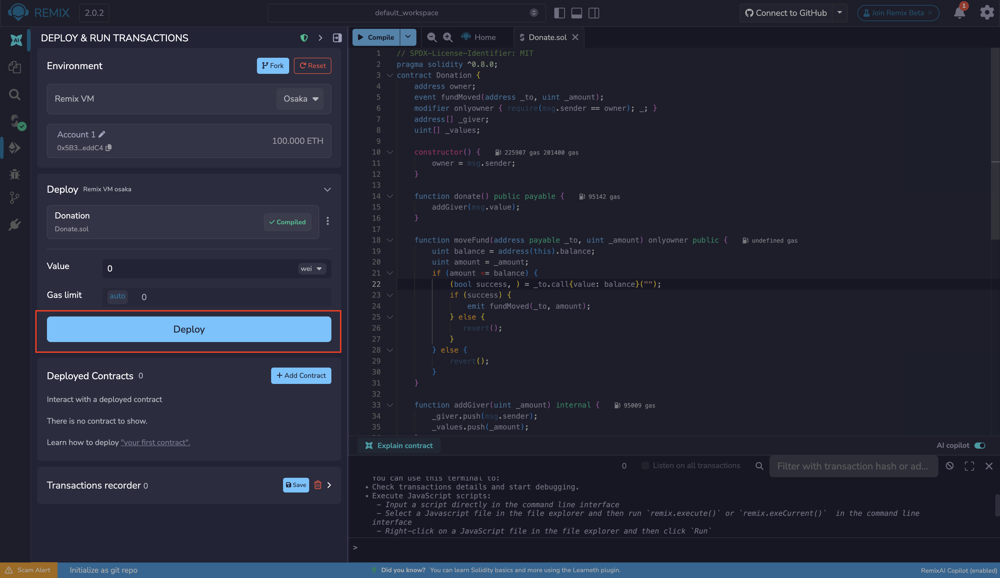
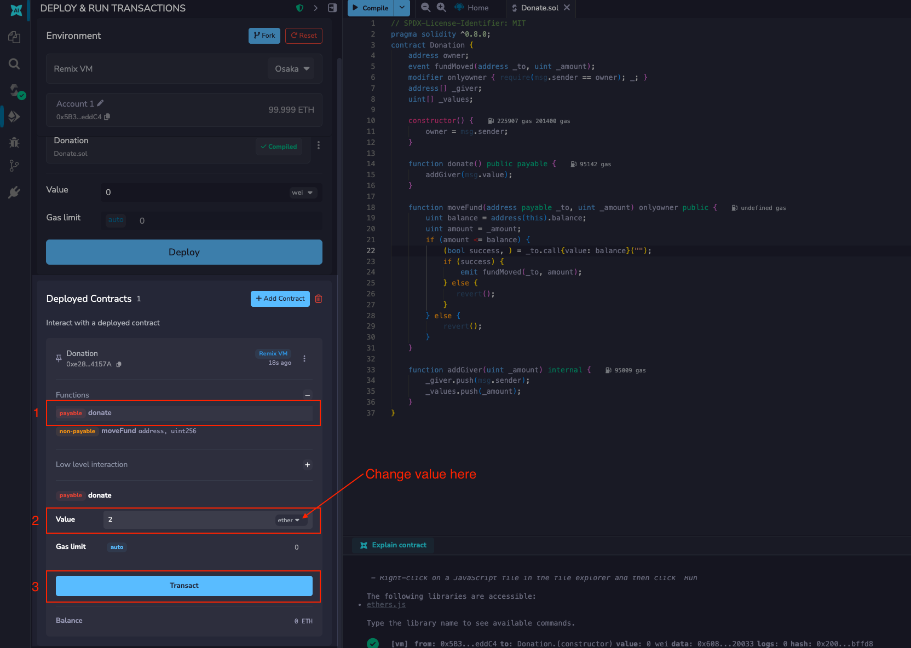
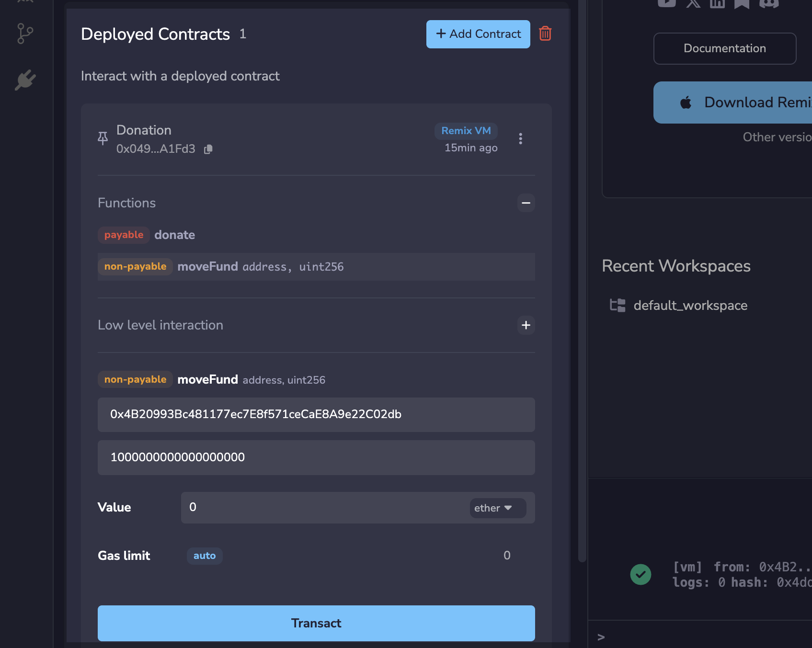
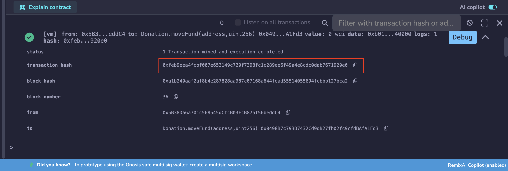
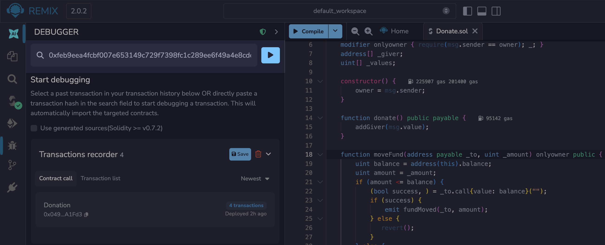
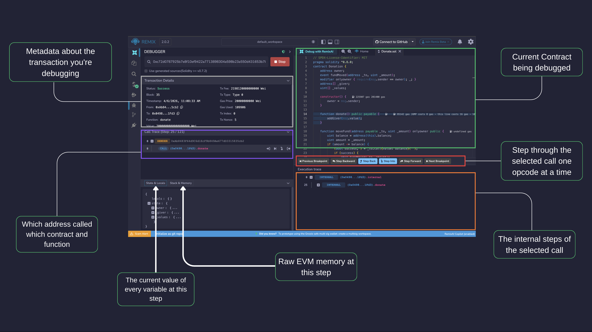

---
myst:
  html_meta:
    "description": "Learn how to debug Ethereum smart contract transactions in Remix IDE by stepping through execution and inspecting state."
    "keywords": "remix debug tutorial, transaction debugging, solidity, remix ide, step through"
---

# Debugging Transactions

```{tip}
Before using this tutorial, we recommend checking out {doc}`the Debugger Tour </debugger>` for an overview of the debugger's interface and panels.
```

When developing smart contracts, things don't always behave as expected. A transaction might revert unexpectedly, a function might return the wrong value, or funds might not move the way you intended.

These are the situations where Remix's debugger becomes essential. It lets you step through a transaction execution line by line, inspect local variables and state at each step, and pinpoint exactly where your contract's logic breaks down.

In this tutorial, we'll walk through using the debugger with a contract that has an intentional bug, so you can see how to identify and trace a problem through the execution flow.

## Debugging a Transaction Made in Remix

We'll use the following `Donation` contract as our example. Don't worry about understanding every detail yet — we'll be using the debugger to explore how it executes.

```Solidity
// SPDX-License-Identifier: MIT
pragma solidity ^0.8.0;
contract Donation {
    address owner;
    event fundMoved(address _to, uint _amount);
    modifier onlyowner { require(msg.sender == owner); _; }
    address[] _giver;
    uint[] _values;

    constructor() {
        owner = msg.sender;
    }

    function donate() public payable {
        addGiver(msg.value);
    }

    function moveFund(address payable _to, uint _amount) onlyowner public {
        uint balance = address(this).balance;
        uint amount = _amount;
        if (amount <= balance) {
            (bool success, ) = _to.call{value: balance}("");
            if (success) {
                emit fundMoved(_to, amount);
            } else {
               revert();
            }
        } else {
            revert();
        }
    }

    function addGiver(uint _amount) internal {
        _giver.push(msg.sender);
        _values.push(_amount);
    }
}
```

Make a new file in Remix and copy the code block above into it, compile it and deploy it on the Remix VM.



We are going to call the `Donate` function and will send 2 Ether.

To do this: in the value input box put in **2** and **select Ether** as the unit. Do not leave the default unit as **gwei** or the change will be hard to detect.



Then click the `Donate` button.

The 2 ETH is now held by the contract. Because we are using the `Remix VM`, the transaction confirms almost instantly.

Now let's try to move 1 ETH out of the contract using `moveFund`. In the deployed instance, find the `moveFund` inputs and provide:

- `_to`: a **different address from the Account dropdown that did not call `donate`**. Use an account with a clean 100 ETH balance so the balance change is clearly visible. Copy the address, then switch back to the owner account to make the call.
- `_amount`: `1000000000000000000` (1 ETH in wei)

```{important}
Before clicking `moveFund`, reset the **Value** field to **0**. Remix keeps the value from the previous `donate` call. Since `moveFund` is not payable, sending ETH with the call will cause it to revert immediately.
```



Click **Transact**.

The transaction succeeds, but check the recipient's balance by selecting their address in the **Account** dropdown. Instead of receiving 1 ETH, the entire 2 ETH contract balance was transferred. Something is wrong.

Notice also that the terminal log shows `_amount: 1000000000000000000` (1 ETH) in the `fundMoved` event, matching what you requested. The event does not reveal the discrepancy because the contract emits `amount` (the requested value) rather than the amount actually sent. Without the debugger, the logs alone would not expose this bug.

In the **terminal**, find the `moveFund` transaction and click its **Debug** button.


The debugger opens and highlights the current execution point in the editor. Use the **Step Forward** button to move forward through `moveFund` line by line.

As you step through the function, watch the **State & Locals** panel. You'll see the local variables populate under the **locals** section as they are assigned:

- `_amount`: the value you passed in: `1000000000000000000` (1 ETH in wei)
- `balance`: the full contract balance: `2000000000000000000` (2 ETH in wei)
- `amount`: assigned from `_amount`: `1000000000000000000` (1 ETH in wei)

Continue stepping until the debugger reaches the transfer line:

```solidity
(bool success, ) = _to.call{value: balance}("");
```

At this point, look at the **locals** section of the **State & Locals** panel. The `value` being sent by the call is `2000000000000000000` (the full contract balance), not the `1000000000000000000` (1 ETH) you requested. The function is sending `balance` instead of `amount`. The check `if (amount <= balance)` used `amount` correctly, but the transfer itself did not.

To fix the bug, change `balance` to `amount` in the transfer line:

```solidity
(bool success, ) = _to.call{value: amount}("");
```

This ensures only the requested amount is sent, not the entire contract balance.

## Starting a Debug Session from the Debugger Panel

As an alternative to clicking **Debug** in the terminal, you can start a session directly from the Debugger panel using a transaction hash.

Click the bug icon in the Icon Panel to open the Debugger. If you don't see the bug icon, activate the Debugger in the Plugin Manager.

To find a transaction hash:

1. Go to a transaction in the terminal.
2. Click a line with a transaction to expand the log.
3. Copy the transaction hash.



Paste the hash into the Debugger and click the button with the Play icon.



## Using the debugger



The debugger allows one to see detailed information about the
transaction's execution. It uses the editor to display the
location in the source code where the current execution is.

The navigation part contains a slider and buttons that can be used to
step through the transaction execution.

### Explanation of Debugger button capabilities

1. Step Backward
   Steps back to the previous opcode without entering function calls. Use this to move backwards without descending into function internals.
2. Step Back
   Steps back to the previous opcode and **will** enter function calls. Use this to trace execution backwards in full detail.
3. Step Into
   Advances to the next opcode and **will** enter function calls. Use this for full visibility into what a function is doing.
4. Step Forward
   Advances to the next opcode without entering function calls. Use this to move forward without stepping into every function.
5. Previous Breakpoint
   Moves the debugger back to the most recently passed breakpoint. Breakpoints are set by clicking a line number in the Editor.
6. Next Breakpoint
   Moves the debugger forward to the next breakpoint ahead in the execution.

## Debugger panels

### State & Locals

The **State & Locals** tab displays a JSON object with two keys:

- `locals`: the local variables in scope at the current execution step
- `state`: the state variables of the contract at the current execution step

### Stack & Memory

The **Stack & Memory** tab displays low-level EVM execution state:

- `opcode`: the current opcode, updated with each step
- `callStack`: the call stack at the current step
- `stack`: the EVM operand stack
- `memory`: the EVM memory, cleared for each new message call

### Breakpoints

Breakpoints can be added and removed by clicking on the line number in the **Editor**. When debugging, execution will jump to the first encountered breakpoint.

```{important}
If you add a breakpoint to a line that declares a variable, it might be triggered twice: once for initializing the variable to zero and a second time for assigning the actual value.
```

Here's an example of this issue. If you are debugging the following contract:

```Solidity
pragma solidity >=0.5.1 <0.6.0;

contract ctr {
    function hid() public {
        uint p = 45;
        uint m;
        m = 89;
        uint l = 34;
    }
}
```

And breakpoints are set for the lines

`uint p = 45;`

`m = 89;`

`uint l = 34;`

then clicking the **Next Breakpoint** button will stop at the following
lines in the given order:

> `uint p = 45;` (declaration of p)
>
> `uint l = 34;` (declaration of l)
>
> `uint p = 45;` (45 assigned to p)
>
> `m = 89;` (89 assigned to m)
>
> `uint l = 34;` (34 assigned to l)
