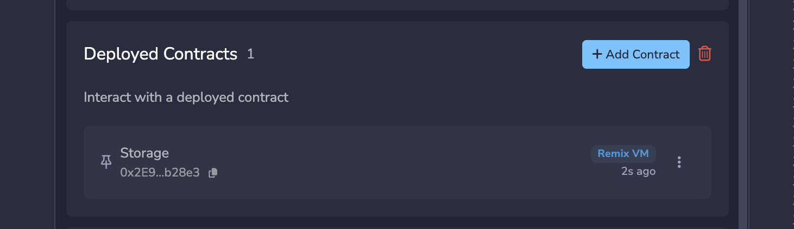
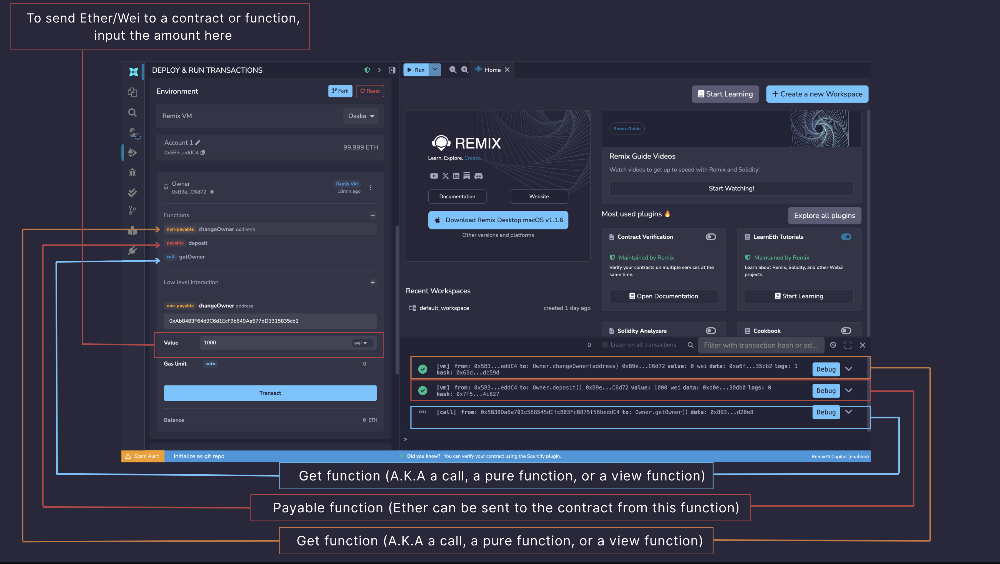
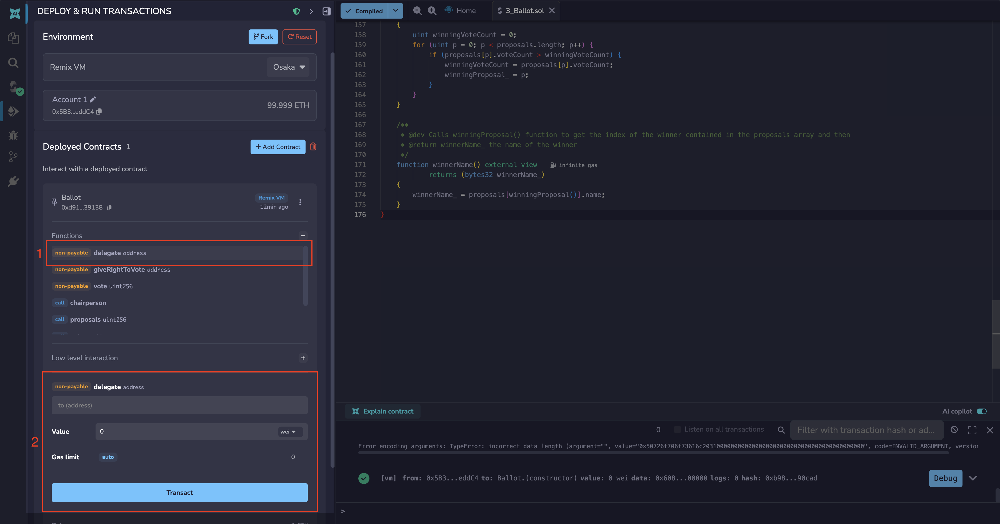
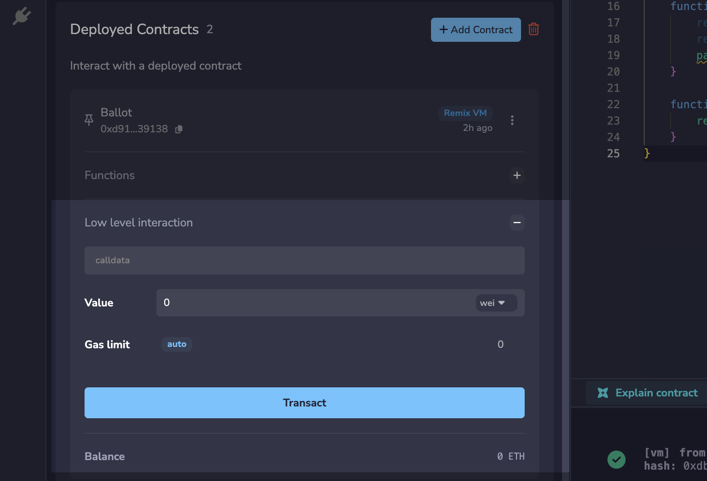
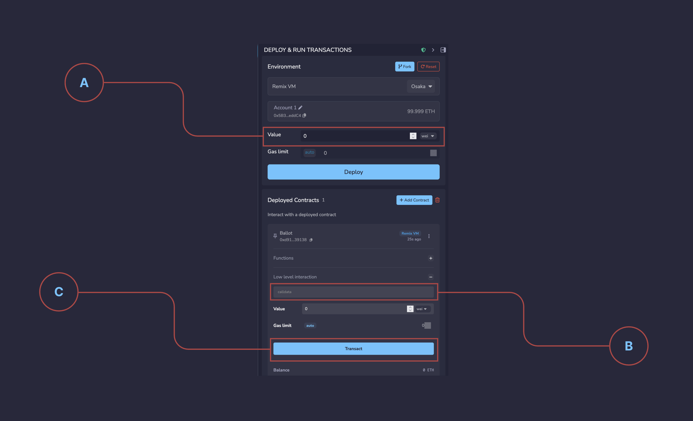
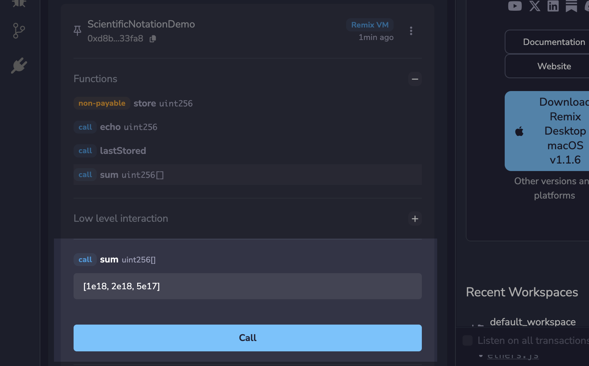

Deploy & Run (part 2)
=====================

.. meta::
   :description: Interact with deployed contracts in Remix IDE — call functions, send transactions, and inspect contract state in the Deploy & Run panel.
   :keywords: remix udapp, deployed contracts, interact contracts, remix ide, send transactions

This is part 2 of the documentation covering the Deploy & Run plugin. Part 1 covers :doc:`deploying and accessing a contract </run>`.

Interacting with deployed contracts
------------------------------------

After you deploy a contract or :ref:`load it into Remix using Add Contract <run:loading deployed contracts>`, the deployed instance will appear in the **Deployed Contracts** section on Deploy & Run.

The deployed contract's address is visible as are a few other icons - one of which is the **pin** icon.

Pinned contracts
----------------

When a contract is pinned, its address and ABI are stored in the ``.deploys`` folder of the current Workspace. Upon reloading Remix, pinned contracts will automatically appear in the **Deployed Contracts** section, provided that both the Workspace and the connected blockchain network remain the same as when the contract was originally pinned.

Functions
---------

To see a contract's functions, click on the deployed contract.

.. video:: images/udapp/viewing-functions.mp4
   :nocontrols:
   :autoplay:
   :playsinline:
   :muted:
   :loop:
   :width: 100%

The functions' buttons can have different colors.

- Blue buttons are for ``view`` or ``pure`` functions. Clicking a blue button does not create a new transaction - so there will be **no gas fees**.

- Orange buttons are for ``non-payable`` functions. Non-payable functions change the state of the contract BUT **do not accept value** (typically ETH) being sent with the transaction. Clicking an orange button will create a transaction and will cost gas.

- Red buttons are for ``payable`` functions. Clicking a red button will create a new transaction and this transaction can accept a **value** (typically ETH). The amount of value is set in the **Value** field which is under the Gas Limit field.

Inputting parameters
--------------------

A function has two views - the collapsed and the expanded view, which is visible after clicking the caret on the right side of the panel.

- The input box shows the expected type of each parameter.
- Numbers and addresses do not need to be wrapped in double quotes.
- Strings do not need to be wrapped.

Clicking the function brings you to the expanded view, where you can input the parameters required for the function.

Low level interactions
----------------------

Low level interactions are used to send funds or calldata or funds & calldata to a contract through the ``receive()`` or ``fallback()`` function. Typically, you should only need to implement the fallback function if you are following an upgrade or proxy pattern.

To find the low level interactions section, you have to click the contract from the Deployed Contracts section, then click the plus icon with the label "Low level interaction". 

.. note::

   If you are executing a plain Ether transfer to a contract, you need to have the ``receive()`` function in your contract. If your contract has been deployed and you want to send it funds, you would input the amount of Ether or Wei etc. (see **A** in graphic below), and then input **NOTHING** in the calldata field of **Low level interactions** (see **B** in graphic) and click the Transact button (see **C** in graphic below).

- If you are sending calldata to your contract with Ether, then you need to use the fallback() function and have it with the state mutability of **payable**.

- If you are not sending ether to the contract but **are** sending call data then you need to use the fallback() function.

- If you break the rules when using the **Low level interactions** you will see a warning.

Please see the `Solidity docs <https://docs.soliditylang.org/en/latest/contracts.html#receive-ether-function>`_ for more specifics about using the **fallback** and **receive** functions.

Scientific Notation in Function Inputs
---------------------------------------

You can use scientific notation to pass numbers as function argument. For example, instead of inputting 12000000000000000000, you can input 12e18. This works for both arrays and single inputs.

Inputting a tuple or struct to a function
------------------------------------------

To pass a tuple, you need to put in an array [].

Similarly, to pass in a struct as a parameter of a function, it needs to be put in as an array [].

.. note::

   The file's pragma must be set to: ``pragma abicoder v2;``

Example of passing nested struct to a function
^^^^^^^^^^^^^^^^^^^^^^^^^^^^^^^^^^^^^^^^^^^^^^^

Consider a nested struct defined like this:

.. code-block:: solidity

   struct Garden {
       uint slugCount;
       uint wormCount;
       Flower[] theFlowers;
   }
   struct Flower {
       uint flowerNum;
       string color;
   }

If a function has the signature ``fertilizer(Garden memory gardenPlot)`` then the correct syntax is:

.. code-block:: solidity

   [1,2,[[3,"Petunia"]]]

To continue on this example, here's a sample contract:

.. code-block:: solidity

   pragma solidity >=0.4.22 <0.7.0;
   pragma experimental ABIEncoderV2;

   contract Sunshine {
       struct Garden {
         uint slugCount;
         uint wormCount;
         Flower[] theFlowers;
       }
       struct Flower {
           uint flowerNum;
           string color;
       }

       function fertilizer(Garden memory gardenPlot) public {
           uint a = gardenPlot.slugCount;
           uint b = gardenPlot.wormCount;
           Flower[] memory cFlowers = gardenPlot.theFlowers;
           uint d = gardenPlot.theFlowers[0].flowerNum;
           string memory e = gardenPlot.theFlowers[0].color;
       }
   }

After compiling, deploying the contract and opening up the deployed instance, we can then add the following input parameters to the function named **fertilizer**:

.. code-block:: solidity

   [1,2,[[3,"Black-eyed Susan"],[4,"Pansy"]]]

The function **fertilizer** accepts a single parameter of the type **Garden**. The type **Garden** is a **struct**. Structs are wrapped in **square brackets**. Inside **Garden** is an array that is an array of structs named **theFlowers**. It gets a set of brackets for the array and another set for the struct. Thus the double square brackets.
